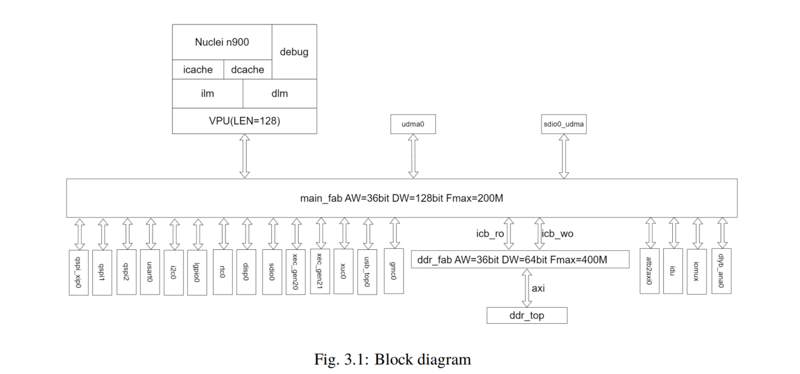
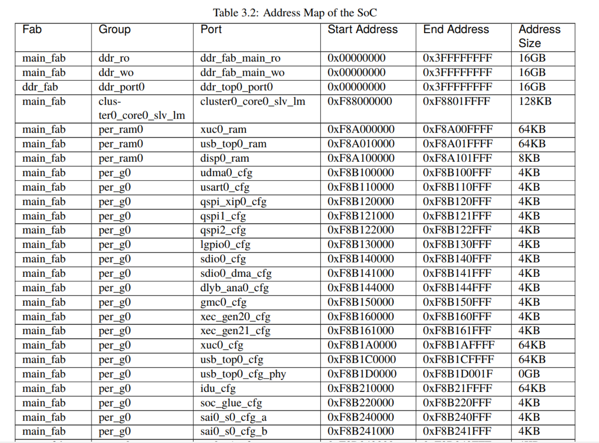
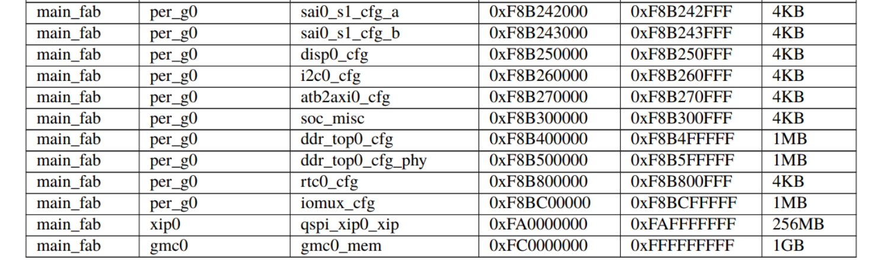

# Nuclei Linux Subsystem Demo Platform

## About Customsoc

Customsoc is Nuclei Subsystem Demo Platform, Only used to develop Nulei Linux peripheral driver,not a formal SOC.
In addition to the RISC-V core and bus, It also contains common peripheral IP,just as following block diagram.




## Customsoc Address Map

currently customsoc map as following:




## Customsoc Linux Driver

each peripheral driver will have its own README_xx.md to illustrate how to use.

currently, following README is available:

- [README_xec.md](./README_xec.md): XEC ethernet driver user guide.

other README and driver will be provided in future.

## Note

Currently, customsoc can only boot from norflash on FPGA platform, cannot boot from SD. Only support 64bit Linux SDK.

10Mhz customsoc Linux sdk compile command:
```
make SOC=customsoc CORE=ux900fd BOOT_MODE=flash CPU_HZ=10000000 TIMER_HZ=10000000 freeloader -j32
```
