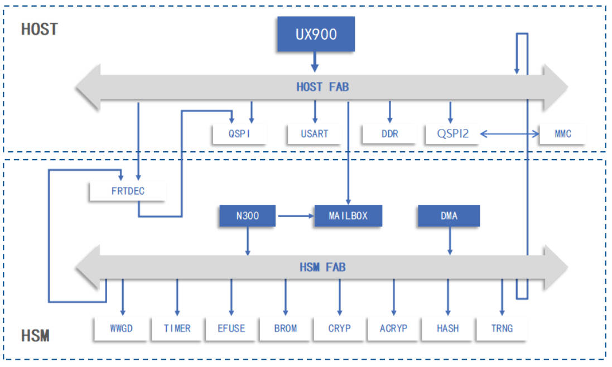
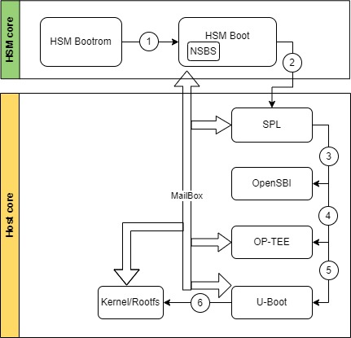
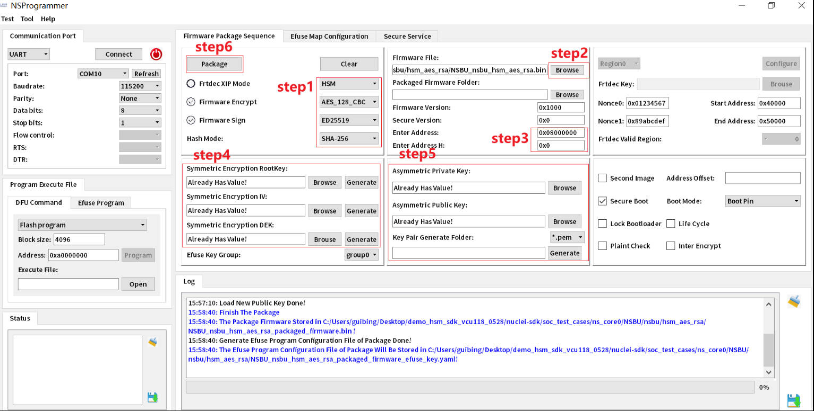
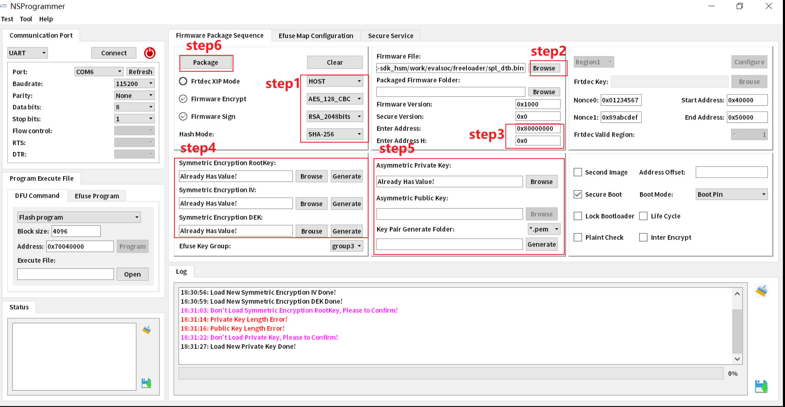
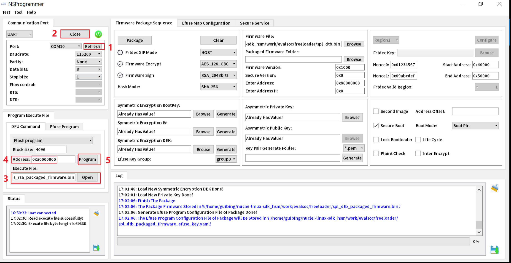
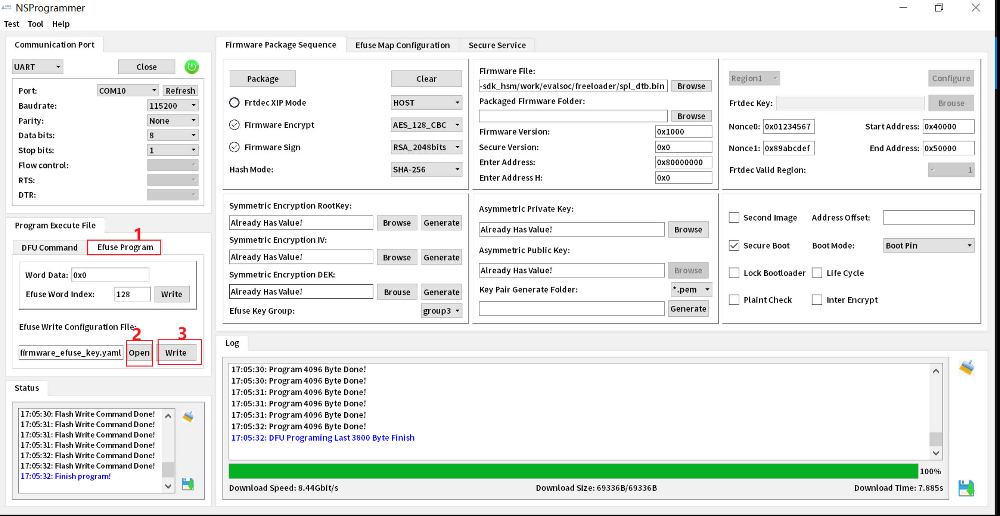

# Nuclei Linux Secure Boot

Nuclei Linux secure boot solution is based on HSM(Hardware Secure Module).
- HSM is a stand-alone processor with a hardware crypto module, usually HSM Bootrom as trust root, decrypt and verify Host first-level boot software.
- Host is a AP processor used to run Linux SDK, which can request HSM crypto service by Mailbox.

## Hardware Architecture



本Linux Secure Boot方案采用异构多核架构：
- HSM：cpu核心是Nuclei N300，其上有Bootrom，Efuse，硬件crypto处理密钥算法及随机数生成，通过Mailbox外设与Host端通信，主要负责安全启动及提供运行时密钥算法服务。
- Host：cpu核心是Nuclei UX900，通过外设Mailbox与HSM通信，还有一些常规外设，比如uart，spi等，主要用来跑Linux系统，处理应用相关的任务。

## Software Architecture

### Secure Boot Flow

Secure Boot启动过程如下图所示。系统上电后，从HSM Bootrom开始，按照序号从①到⑥的顺序，依次解密校验执行，任何一级解密或校验失败，都会导致boot过程失败。图中OP-TEE是可选项，如果不需要TEE的执行环境，序号④解密及校验OP-TEE的过程可以去掉。



1. HSM Boot Flow:

- HSM Bootrom从flash加载hsmboot到HSM ILM SRAM做验签解密，对应上图中的序号①。
- HSM Boot从flash加载SPL到Host CLM SRAM做验签解密、运行NSBS等待Host请求crypto 服务，对应上图中的序号②。

由于HSM不是本文关注重点，所以只简要说一下HSM的执行过程。

`ILM`：instruction local memory

`CLM`：cluster local memory, 在boot阶段用作SRAM, opensbi执行阶段会将CLM配置成L2 cache

`NSBS`: Nuclei Secure Boot and Service

2. Host Boot Flow:

- SPL是Host的第一级boot，运行在Host CLM SRAM中，主要功能：初始化DDR，从flash加载opensbi/optee/uboot到DDR，验签解密，对应上图中的序号③④⑤。
- U-Boot是Host的第二级boot，运行在DDR中，主要功能：从SD卡加载kernel/rootfs到DDR，验签解密，对应上图中的序号⑥。

目前SPL/U-Boot原生代码使用的加密算法是AES，签名算法是RSA，如果需要其他算法，需要用户自行扩展U-Boot加解密，签名算法。

Host验签和解密操作是通过Mailbox请求HSM NSBS服务来完成的。

### Image Format

#### HSM Image Format

本Linux Secure Boot系统中hsmboot和SPL都由HSM 软件系统完成校验和解密，所以hsmboot和SPL使用了HSM 镜像的格式，其格式如下：

|  HSM Image Format  |
| ---- |
| **Boot Configuration** |
| **Payload** |
| **Payload Digest** |
| **Payload Digest Signature** |
| **DEK(wrapped)** |
| **Public Key(optional)** |

#### Host Image Format

Host image use FIT(Flat Image Tree) format for packaging images. FIT format allows more flexibility in handling images of various types (kernel, ramdisk, etc.), it also enhances integrity protection of images and confidential protection of images. 

`.its`: image tree source, 用来描述image 内容和image cipher and signature config

`.itb`: flattened image tree blob, uboot mkimage calls dtc to create .itb image

opensbi/uboot/kernel/rootfs 都是使用its文件来组织image的。
uboot_spl.its：组织opensbi/uboot 镜像的文件
uboot.its：组织kernel/rootfs 镜像的文件

More details info about FIT, please refer to https://docs.u-boot.org/en/latest/usage/fit/index.html

mkimage 工具用来读取its，生成itb image，mkimage help 信息如下。

```
Usage: ./mkimage [-T type] -l image
          -l ==> list image header information
          -T ==> parse image file as 'type'
          -q ==> quiet
       ./mkimage [-x] -A arch -O os -T type -C comp -a addr -e ep -n name -d data_file[:data_file...] image
          -A ==> set architecture to 'arch'
          -O ==> set operating system to 'os'
          -T ==> set image type to 'type'
          -C ==> set compression type 'comp'
          -a ==> set load address to 'addr' (hex)
          -e ==> set entry point to 'ep' (hex)
          -n ==> set image name to 'name'
          -R ==> set second image name to 'name'
          -d ==> use image data from 'datafile'
          -x ==> set XIP (execute in place)
          -s ==> create an image with no data
          -v ==> verbose
       ./mkimage [-D dtc_options] [-f fit-image.its|-f auto|-f auto-conf|-F] [-b <dtb> [-b <dtb>]] [-E] [-B size] [-i <ramdisk.cpio.gz>] fit-image
           <dtb> file is used with -f auto, it may occur multiple times.
          -D => set all options for device tree compiler
          -f => input filename for FIT source
          -i => input filename for ramdisk file
          -E => place data outside of the FIT structure
          -B => align size in hex for FIT structure and header
          -b => append the device tree binary to the FIT
          -t => update the timestamp in the FIT
Signing / verified boot options: [-k keydir] [-K dtb] [ -c <comment>] [-p addr] [-r] [-N engine]
          -k => set directory containing private keys
          -K => write public keys to this .dtb file
          -g => set key name hint
          -G => use this signing key (in lieu of -k)
          -c => add comment in signature node
          -F => re-sign existing FIT image
          -p => place external data at a static position
          -r => mark keys used as 'required' in dtb
          -N => openssl engine to use for signing
          -o => algorithm to use for signing
       ./mkimage -V ==> print version information and exit
Use '-T list' to see a list of available image types
Long options are available; read the man page for details
```

## Linux SDK Compile

### HSM Compile

获取HSM nuclei-sdk源码包，可以联系Nuclei AE获取。

编译命令如下：

```
$cd nuclei_sdk_dir\soc_test_cases\ns_core0\NSBU\nsbu\hsm_aes_rsa> 
$make SOC=ns_core0 clean bin
```
`ns_core0`：hsmboot的core对应的目录

修改`SPL固件在Flash上的烧录位置`：

假设SPL后续烧录在flash上0xa0040000的位置，则会修改hsm_aes_rsa中secure_boot_args.fw_addr的值，如下代码所示：

```
secure_boot_args.fw_addr=(0xa0000000+0x40000);
secure_boot_args.role=1;
if (enter_secure_boot(&secure_boot_args)!=0)
{
        printf("boot core1 fail\r\n");
        simulation_fail();
        while(1);
}
```

假设编译生成的image名字为NSBU_nsbu_hsm_aes_rsa.bin，其需要通过NStool打包后烧录到flash上，具体可参考[image-deploy chapter](#image-deploy)


### Host Compile

1.源码下载：

```
$git clone 
```

2.编译命令：

```
$make SOC=evalsoc CORE=ux900fd freeloader -j
```

`注意此处和普通Linux SDK编译有些不同，因为涉及到签名加密，这里只需要make freeloader就会编译Linux kernel和rootfs文件系统，不需要再执行make bootimages命令`。

**特别说明**

1).opensbi_uboot.bin 固件烧录位置

opensbi_uboot.bin 固件烧录的位置和SPL中`CONFIG_SPL_LOAD_FIT_ADDRESS=0xa0060000` 配置要保持一致。
目前Linux HSM SDK中给SPL 固件在FLASH上预留的大小为0x20000，opensbi_uboot.bin烧录位置：0xa0040000（SPL位置）+ 0x20000=0xa0060000，如果需要修改SPL在Flash上的大小也可以按照这样做，保证SPL中CONFIG_SPL_LOAD_FIT_ADDRESS的配置值和opensbi_uboot.bin的烧录位置相同。

2).Mailbox 硬件通道

如果需要Linux和OP-TEE能同时支持HSM Crypto 操作，则SOC中mailbox 硬件channel 至少需要两个通道。
Linux 系统固定使用Mailbox channel0，OP-TEE可以使用其他channel。optee_os代码中MAILBOX_AVALIABLE_MAX_NUM定义了硬件可用的channel 个数。
当前测试的bitfile只配置了一个硬件channel，optee_os中MAILBOX_AVALIABLE_MAX_NUM定义为1，所以Linux HSM Crypto驱动和OP-TEE中HSM Crypto不能同时使用，否则会出现类似下面"no available mailbox"的错误。

```
# optee_example_hello_world
E/TC:0 0 nuclei_cipher_update:218 no available mailbox
E/LD:  init_elf:486 sys_open_ta_bin(8aaaf200-2450-11e4-abe2-0002a5d5c51b)
E/TC:0 0 ldelf_init_with_ldelf:131 ldelf failed with res: 0xffff000d
E/TC:0 0
E/TC:0 0 Core data-abort at address 0x0 (alignment fault)
E/TC:0 0 cpu    #0
E/TC:0 0 cause  000000000000000D epc    00000000C080612C
E/TC:0 0 tval   0000000000000000 status 0000000200040100
E/TC:0 0 ra     00000000C0807670 sp     00000000C0883D60
E/TC:0 0 gp     0000000000000000 tp     00000000C004B000
E/TC:0 0 t0     0000000000000001 t1     0000000000000001
E/TC:0 0 t2     0000000000000003 s0     0000000000000008
E/TC:0 0 s1     0000000000000004 a0     0000000000000000
E/TC:0 0 a1     00000000C0883D70 a2     0000000000000002
E/TC:0 0 a3     0000000000000008 a4     0000000000000040
E/TC:0 0 a5     00000000C084B7A8 a5     00000000C084B7A8
E/TC:0 0 a6     00000000C0883EE8 a7     0000000000000004
E/TC:0 0 s2     00000000C0883DF0 s3     0000000000000004
E/TC:0 0 s4     0000000000000000 s5     0000000000000000
E/TC:0 0 s6     0000000000000000 s7     0000000000000000
E/TC:0 0 s8     0000000000000000 s9     0000000000000000
E/TC:0 0 s10    0000000000000000 s11    0000000000000000
E/TC:0 0 t3     0000000000000000 t4     7FFFFFFFFFFFFFDF
E/TC:0 0 t5     0000000000000140 t6     0000000000000000
E/TC:0 0 TEE load address @ 0xc0800000
E/TC:0 0 Panic '[abort] alignment fault!  (trap CPU)' at ?:0
```


3.生成的image：

`SPL image`: nuclei_linux_sdk_dir/work/evalsoc/freeloader/spl_dtb.bin

`opensbi/uboot image`: nuclei_linux_sdk_dir/work/evalsoc/freeloader/opensbi_uboot.bin

`kernel/rootfs image`:
nuclei_linux_sdk_dir/work/evalsoc/boot/kernel.itb

以上镜像只有kernel.itb 需要存放在SD卡上，其他镜像都需要烧录到flash上，具体可参考[image-deploy chapter](#image-deploy)

Nuclei Secureboot Linux SDK在编译时，会自动生成随机的rsa key签名，aes key加密。生成key的命令和生成itb的命令都在nuclei_linux_sdk_dir/Makefile 文件中，下面对重要的地方做些说明。

#### Generate key

下面是Makefile中SPL RSA key和AES key的生成过程，需要编译Linux SDK的电脑上安装了openssl。

openssl命令生成RSA2048 private key spl.key，用于签名(signature)

```
openssl genpkey -algorithm RSA -out keys/spl.key -pkeyopt rsa_keygen_bits:2048 -pkeyopt rsa_keygen_pubexp:65537
```

openssl命令生成x509 证书spl.crt，用于验签名(verify signature)

```
openssl req -batch -new -x509 -key keys/spl.key -sha256 -out keys/spl.crt
```

dd命令生成AES加解密key

```
dd if=/dev/urandom of=keys/aes256key_spl.bin bs=1 count=32
```

#### Import Key

uboot_spl.its 文件使用key-name-hint来引用前面生成的key。
比如opensbi加解密使用的aes256算法，key-name-hint = "aes256key_spl"，表示使用aes256key_spl.key来加解密。
签名使用的sha256,ras2048,key-name-hint = "spl"，表示rsa signature 使用的是spl.key, rsa signature verify用的public key 写在了dtb中。

```
/ {
        description = "UBoot SPL Image";
        #address-cells = <2>;

        images {
                opensbi {
                        description = "OpenSBI Dynamic Firmaware";
                        data = /incbin/("opensbi.bin");
                        type = "firmware";
                        arch = "riscv";
                        os = "opensbi";
                        load =  <0x0 0xc0000000>;
                        entry = <0x0 0xc0000000>;
                        compression = "none";
                        cipher {
                                algo = "aes256";
                                key-name-hint = "aes256key_spl"; -->对应aes256key_spl.bin文件
                        };
                        signature {
                                algo = "sha256,rsa2048";
                                key-name-hint = "spl"; -->对应spl.key文件
                        };
                };
                uboot {
                        description = "U-Boot";
                        data = /incbin/("u-boot.bin");
                        ....
                        cipher {
                                algo = "aes256";
                                key-name-hint = "aes256key_spl";
                        };
                        signature {
                                algo = "sha256,rsa2048";
                                key-name-hint = "spl";
                        };
                };
        };
}
```

#### Generate Itb

生成itb 命令

```
$(uboot_mkimage) -f spl.its -K $(uboot_spl_dtb) -k $(wrkdir)/keys -r $(uboot_spl_itb)
```

`-k` : set directory containing private keys
`-K` : write public keys to this .dtb file
`-r` : mark keys used as 'required' in dtb

从编译生成的文件nuclei_linux_sdk_dir/work/evalsoc/u-boot_spl/spl.dtb 读取信息
`$fdtdump spl.dtb | less`
可以看到signature和cipher key的信息插入到DTB中了

```
/dts-v1/;
// magic:               0xd00dfeed
// totalsize:           0x20aa (8362)
// off_dt_struct:       0x38
// off_dt_strings:      0x15f8
// off_mem_rsvmap:      0x28
// version:             17
// last_comp_version:   16
// boot_cpuid_phys:     0x0
// size_dt_strings:     0x23d
// size_dt_struct:      0x15c0

/ {
    #address-cells = <0x00000002>;
    #size-cells = <0x00000002>;
    compatible = "nuclei,evalsoc";
    model = "nuclei,evalsoc";
    dma-noncoherent;
    signature {
        key-spl {
            required = "image";
            algo = "sha256,rsa2048";
            rsa,r-squared = <0x9c34a315 0x7b50d46e 0xa147538b 0x3a112816 0xbcc23c62 0xa3101583 0xcbcf288c 0x6d6093e0 0x1f0bfd74
 0x17de9127 0x9a9b8c27 0x1aecd0a4 0x2884805b 0x1417e369 0xee021ca8 0xf476b0df 0x76b399fc 0x3ca0f3fa 0xa650db6e 0x24d22a1e 0x56d
b72c5 0x9631301f 0x21576095 0x691a7b04 0xfa87cc52 0x31b24497 0xcfe2c7dc 0x7cd13203 0x79a72d14 0x19cae72a 0xcb552dc5 0x524a4495
0xa017f749 0x7d75878d 0x0e3518ba 0x0835f110 0x9a948b74 0xc1c3672a 0x2cab7543 0x04b8a5f5 0x6c92f434 0x04486e4f 0x594a6380 0x1b3f
2f06 0xd72c18ab 0x0277f918 0x924ebb29 0x12396aa5 0xae43c5c2 0x94a984f1 0x437b2542 0x7bde160f 0x9e56b8e7 0x8215094d 0xe435debb 0x6f206dab 0x8877d257 0x9e78d34e 0x2d1a9251 0x83e79e48 0x71e75a6d 0xcf166e80 0x91648954 0x6b992057>;
            rsa,modulus = <0xdb5c43ec 0x469ace3a 0x735605d3 0xf08646df 0x208b55e8 0x1053994e 0xa00edebe 0xda400ead 0xb650665a 0x5338530b 0xeb3aca5b 0x6b3426b7 0x85588a57 0xb03e27d1 0x3c01184b 0x8bf05110 0x2263dc94 0x8f0693e4 0x68c8bdf4 0xc4d9124c 0x0a061ced 0xc58bfcdb 0x989eb256 0x0d6b9045 0xf211d962 0xcae112b5 0x07897396 0x70d7efbc 0xff5453d6 0xed4e179d 0xbf96e800 0xcc42217e 0x1885b992 0x463971e5 0x1a3a0dd5 0x6e213b6c 0x520144e6 0x35b01a7a 0x54d1c566 0xd6f18918 0x1db07ad6 0xbb4e5c5e 0x1cb8d75b 0xd5f2eb8e 0xcc3a3dd5 0x0635867a 0xa9549f50 0x41ccc933 0x5c18a268 0x40f16a53 0x3fa8309a 0xa672d816 0x52f3dc20 0x31ce1a6c 0xcbb5edc3 0x238b421e 0xbabbdda8 0xd6288d32 0x47c6c320 0x237a64dc 0x3b4041f2 0xe98c1ea3 0x1ec816df 0xb5ea905f>;
            rsa,exponent = <0x00000000 0x00010001>;
            rsa,n0-inverse = <0x56b43461>;
            rsa,num-bits = <0x00000800>;
            key-name-hint = "spl";
        };
    };
    cipher {
        key-aes256-aes256key_spl {
            key-len = <0x00000020>;
            key = <0xfb460c02 0x35b1ba6a 0xeedb3664 0xad62527f 0x9f5e35de 0xa8c7d2fa 0xfca42845 0x96ef9840>;
        };
    };
    chosen {
        bootargs = "earlycon=sbi console=ttyNUC0";
        stdout-path = "serial0";
    };
    ....
}
```

从编译生成的文件nuclei_linux_sdk_dir/work/evalsoc/u-boot_spl/uboot_spl.itb 读取信息
`$fdtdump uboot_spl.itb | less` 
可以看到签名和加密的结果

```
/ {
    images {
        opensbi {
            data-size-unciphered = <0x00041e98>; -->opensbi 解密后的长度
            description = "OpenSBI Dynamic Firmaware";
            data = <0xb69efc0f 0x6b15d697 0x91f5a039 ....> --> opensbi加密后的数据
            type = "firmware";
            arch = "riscv";
            os = "opensbi";
            load = <0x00000000 0xc0000000>;
            entry = <0x00000000 0xc0000000>;
            compression = "none";
            cipher {
                iv = <0x836c6514 0x1189d160 0xbcc8d87f 0xc49456d9>;--> opensbi 加密时使用的iv
                algo = "aes256";
                key-name-hint = "aes256key_spl";
            };
            signature {
                timestamp = <0x6777c106>; -->signature timestamp
                signer-version = "2023.10-00016-g4f2624f7c61"; -->mkimage的版本
                signer-name = "mkimage";
                value = <0xc9523802 0x69525bd0 0x4c54cbb2 0xc795c676 0xdd75c603 0x3d921eec 0xe5719491 0x702f7c48 0xa75cac51 0xd
f4752fa 0x0a1dd5d9 0xc202fc68 0x7e819c56 0x2c80fb09 0x781398d1 0xf41ca05e 0xce8c52bd 0xb721c793 0x8d52f4c9 0x25bf595d 0x8e6d79e
9 0xc987bfa3 0x5fe30fe4 0xe58fd645 0xa45d7911 0xa217ce33 0xf796fd3d 0xa550aedb 0xce59e113 0x0d1566b1 0x37ea7fbd 0x5e0328fd 0x39
898d10 0x904e9fec 0x56bc4121 0x00f17e24 0x457248ec 0xe8e8d916 0x1b87b386 0x49caa544 0xdf2f3fd3 0x3b046850 0xda0650e5 0x6498c721
 0xe8019c78 0x1782714f 0x99c21c09 0xbff4d311 0xca7931c8 0x4a4dafef 0xcf2199ab 0xafd7398b 0x90d37c6a 0x52d6ba10 0xf8c371e0 0xf65
02cfd 0x2dfc4313 0x1b6ca2d3 0x926319d9 0xd8cb5fe6 0xa045d1e3 0xe36474d2 0x5828c584 0x899997cf>;-->opensbi 的rsa signature
                algo = "sha256,rsa2048";
                key-name-hint = "spl";
            };
        };
        uboot {
            data-size-unciphered = <0x00066388>; -->uboot 解密后的数据长度
            description = "U-Boot";
            data = <0x8c8c1162 0xe6021284...>  -->uboot 加密后的数据
            ...
            cipher {
                iv = <0x4433b05f 0x8510fce7 0xd8fd0eb3 0xbcefaa99>;-->uboot 加解密用的iv
                algo = "aes256";
                key-name-hint = "aes256key_spl";
            };
            signature {
                timestamp = <0x6777c106>;
                signer-version = "2023.10-00016-g4f2624f7c61";
                signer-name = "mkimage";
                value = <0x309674e9 0x58066066 0x1250e6bc 0x5b190580 0x9c03634f 0x9b49cc76 0x7d2cf624 0x4548c807 0x9f5f1b60 0x3
2012615 0xdace798a 0x47fcd1b6 0xa821fba6 0x12b4dfd0 0x14e53071 0x10eda8d3 0x46f18ca3 0xca040771 0xab70694a 0x2a2c7a8a 0x0f708aa
f 0x4c622a7d 0xed6e6634 0x6af62183 0xb88a6e49 0xe7ad74d3 0x934fe99a 0x070657b9 0xaecaa2bc 0x85cd0b96 0x1c562b4f 0x78288bde 0x80
a66cb0 0x88566e4e 0x5165ceed 0xfb80ed96 0xb671e286 0x0dd98568 0x6cb42ab5 0xa2f189c2 0x61d1cfce 0x6a56e204 0x8d8bec2b 0x3b085000
 0xae90c341 0xa93549c7 0x59febcfc 0x9fa3b8d2 0xf4ed4931 0xfc1f3e25 0x96c6e135 0x171f3940 0x1dcb95b0 0x7ef36603 0xbbfd711d 0xfb3
f2a0c 0x38038513 0x67e958ce 0x1648f3ce 0x2886b18f 0x7a733b62 0x778d4624 0xc94f77dd 0xe3c91664>; -->uboot signature value
                algo = "sha256,rsa2048";
                key-name-hint = "spl";
            };
        };
    };
}
```

## HSM Crypto Driver

HSM Crypto Driver是Host端通过Mailbox给HSM端发送密钥算法请求，HSM端收到请求后，使用Crypto硬件完成算法，并把计算结果通过Mailbox发送给Host端，这样Host端就完成了密钥算法。

### Configuration

#### U-Boot Config

在spl和uboot中默认是使用Nuclei HSM crypto硬件来实现加解密和验证签名，相关`U-Boot CONFIG`配置如下：

```
CONFIG_NUCLEI_HSM_AES=y -->用HSM AES 需要选上
CONFIG_NUCLEI_HSM_RSA=y -->用HSM RSA 需要选上
CONFIG_NUCLEI_HSM_SHA=y -->用HSM SHA 需要选上
CONFIG_SHA_HW_ACCEL=y --> 用HSM SHA 需要选上
CONFIG_SHA_PROG_HW_ACCEL=y -->用HSM SHA 需要选上
```

以上CONFIG可以通过make SOC=evalsoc CORE=ux900fd uboot-menuconfig 的方式配置。

#### Linux Config

在Linux kernel中也实现了基于Nuclei HSM crypto硬件的AES/SM4/SHA1/SHA256/MD5/HMAC算法，相关`Linux CONFIG`配置如下：

```
CONFIG_NUCLEI_MAILBOX=y
CONFIG_CRYPTO_DEV_NUCLEI_HSM=y
```

以上CONFIG可以通过make SOC=evalsoc CORE=ux900fd linux-menuconfig 的方式配置。

#### OP-TEE Config

在OP-TEE os中也实现了基于Nuclei HSM crypto硬件的AES/SM4/SHA1/SHA256/MD5/HMAC/RSA算法，，相关`OP-TEE CONFIG`配置如下：

```
CFG_NUCLEI_HSM_CRYPTO=y
CFG_CRYPTO_DRV_CIPHER=y
CFG_CRYPTO_DRV_HASH=y
CFG_CRYPTO_DRV_MAC=y
CFG_CRYPTO_DRV_ACIPHER=y
CFG_CRYPTO_DRV_RSA=y
```

以上CONFIG可以通过修改optee/optee-os/core/arch/riscv/plat-nuclei/conf.mk 文件实现

```
$(call force,CFG_NUCLEI_HSM_CRYPTO,y)
$(call force,CFG_CRYPTO_DRV_CIPHER,y)
$(call force,CFG_CRYPTO_DRV_HASH,y)
$(call force,CFG_CRYPTO_DRV_MAC,y)
$(call force,CFG_CRYPTO_DRV_ACIPHER,y)
$(call force,CFG_CRYPTO_DRV_RSA,y)
```

- CFG_NUCLEI_HSM_CRYPTO ：总开关，这个配置n，则optee 中不支持NUCLEI HSM 硬件crypto。
- CFG_NUCLEI_HSM_CRYPTO: aes/sm4 开关
- CFG_CRYPTO_DRV_HASH: hash 开关
- CFG_CRYPTO_DRV_MAC: hmac 开关
- CFG_CRYPTO_DRV_ACIPHER，CFG_CRYPTO_DRV_RSA: rsa开关

### Related Files

SPL/U-Boot中HSM crypto driver文件,主要实现了AES/SHA/RSA算法
```
$nuclei_linux_sdk_dir/u-boot/drivers/crypto/nuclei$ tree
.
├── aes.c
├── Kconfig
├── mailbox.c
├── mailbox.h
├── mailbox_lowlevel.c
├── mailbox_lowlevel.h
├── Makefile
├── rsa.c
└── sha.c
```

Linux Kernel中HSM crypto driver文件, 主要实现了AES/SM4/SHA1/SHA256/MD5/HMAC算法
```
$nuclei_linux_sdk_dir/linux/drivers/crypto/nuclei$ tree
.
├── Kconfig
├── Makefile
├── nuclei_abi.h
├── nuclei_crypto_ahash.c
├── nuclei_crypto.c
├── nuclei_crypto.h
└── nuclei_crypto_skcipher.c
```

OP-TEE os HSM crypto driver文件
```
$ cd nuclei_linux_sdk_dir/optee/optee_os
$ tree core/drivers/crypto/nuclei/
core/drivers/crypto/nuclei/
├── cipher.c
├── common.h
├── crypto.mk
├── hash.c
├── hmac.c
├── mailbox.c
├── mailbox.h
├── nuclei_hsm_abi.h
├── nuclei_hsm_cryp.c
├── rsa.c
└── sub.mk
```

## Host HW Memory Mapping

|hw module | start_addr | size | comment |
|---|---|---|---|
|PLIC| 0x4000000 | 0x4000000 | PLIC 外设中断控制器，用于外设中断 |
|CLINT| 0x31000 | 0xC000 | CLINT 中断控制器，用于timer，ipi中断 |
|DDR| 0xC000000 | 0x40000000 | 外部DDR 内存 |
|UART0|0x90120000 | 0x1000 | 串口 |
|QSPI0|0x90180000 | 0x1000 | SPI0接口，用于xipflash |
|QSPI2|0x901a0000 | 0x1000 | SPI2接口，用于sd卡 |
|MAILBOX|0x97000000 | 0x3000 | Host MAILBOX 接口 |
|CLM | 0x80000000 | 0x100000 | Cluster Local Memory |

## Host SW Memory Mapping

本系统在FPGA平台上验证，其软件运行Memory Mapping如下：
|name | start_addr | end_addr | comment |
|---|---|---|---|
|spl|0x80000000 | 0x81000000 | 运行在LocalMemory，后续这段区域用作L2 cache|
|opensbi|0xc0000000 | 0xc0080000 | 运行在DDR中|
|optee share memory|0xc0200000 | 0xc0400000 | 运行在DDR中|
|optee|0xc0800000 | 0xc1000000 | 运行在DDR中|
|uboot|0xc1200000 | 0xffffffff | 运行在DDR中|
|linux|0xc1000000 | 0xffffffff | 运行在DDR中|

## Image Deploy

本节主要介绍烧录前NStool打包、需要NStool烧录的文件及如何烧录，关于NStool烧录工具详细的用法请参考NStool文档。

除了kernel.itb需要存放在SD卡上，其他镜像都需要使用NStool烧录到flash上。

### Package Image

由于hsmboot和SPL使用的是HSM Image Format，所以烧录前需要使用NStool打包成HSM Image 格式。

`Linux SDK 编译后的镜像，除了SPL是HSM Image Format外，其他都是采用FIT格式，不需要NStool打包。`

#### Package hsmboot Image

使用NStool工具对hsm编译后生成的NSBU_nsbu_hsm_aes_rsa.bin打包

按照下图的6个步骤打包hsmboot镜像



- step1：hsmboot是HSM端的image，这里选HSM。配置hsmboot的签名和加密算法
- step2：指定hsmboot bin文件的路径
- step3：hsmboot运行的地址
- step4：配置加密算法用的key和iv
- step5：配置签名算法用的key
- step6：打包按钮，会生成打包后的bin文件和烧录在efuse中的yaml文件

package 后生成下面两个文件：
- NSBU_nsbu_hsm_aes_rsa_packaged_firmware.bin -->hsm格式的hsmboot镜像
- NSBU_nsbu_hsm_aes_rsa_packaged_firmware_efuse_key.yaml -->hsmboot efuse 配置

因NStool 版本不同，可能生成的文件名稍有差异，以NStool文档为准。

#### Package SPL Image

SPL image由HSM负责解密校验，所以使用了HSM镜像格式，在编译完Linux SDK后，需要使用NStool工具对
linux_sdk_dir/work/evalsoc/freeloader/spl_dtb.bin package打包，生成HSM镜像格式。

按照下图的6个步骤打包SPL镜像



- step1：SPL 是Host端的image，这里选Host。配置SPL的签名和加密算法
- step2：指定spl_dtb.bin 文件的路径
- step3：SPL运行的地址
- step4：配置加密算法用的key和iv
- step5：配置签名算法用的key
- step6：打包按钮，会生成打包后的bin文件和烧录在efuse中的yaml文件

package 后生成下面两个文件：
- spl_dtb_packaged_firmware.bin -->hsm格式的spl镜像
- spl_dtb_packaged_firmware_efuse_key.yaml -->spl efuse配置

因NStool 版本不同，可能生成的文件名稍有差异，以NStool文档为准。

### Burn Image and Efuse

**烧录前**拨码使FPGA板或芯片板BOOT Mode处于DFU烧录模式。上电后，板子从Bootrom进入DFU烧录状态，用NStool烧录镜像和efuse。

**烧录后**拨码使FPGA板或芯片板BOOT Mode处于介质启动模式（比如Flash启动）。上电后，板子从Bootrom读取介质开始执行。

需要使用NStool工具烧录的image文件包括：

`hsmboot`：NSBU_nsbu_hsm_aes_rsa_packaged_firmware.bin

`spl`：spl_dtb_packaged_firmware.bin

`opensbi/uboot`：opensbi_uboot.bin

Nuclei Secure Boot Linux SDK 上面各image默认的烧录地址如下：
|image name  | flash address |
|:-------------| :---------- |
|hsmboot       | 0xa0000000  |
|spl           | 0xa0040000  |
|opensbi/uboot | 0xa0060000  |

`注意：flash的烧录地址和程序代码密切相关`

需要使用NStool工具烧录的efuse文件包括：
- NSBU_nsbu_hsm_aes_rsa_packaged_firmware_efuse_key.yaml
- spl_dtb_packaged_firmware_efuse_key.yaml

下面是NStool 烧录image界面：



- 步骤1和2是正确配置串口参数，通过串口连接板子
- 步骤3是选择要烧录的文件路径
- 步骤4是选择文件烧录到介质上的起始地址，`注意：不同镜像的烧录地址不同`
- 步骤5是开始烧录

下面是NStool 烧录efuse界面：



- 烧录前先串口连上板子
- 步骤1是切换到烧录efuse的界面
- 步骤2是选择要烧录的efuse文件
- 步骤3是开始烧录

## Linux Secure Boot Log

```
Nuclei SDK Build Time: Mar  6 2025, 16:25:40
Download Mode: ILM
CPU Frequency 20000000 Hz
CPU HartID: 0
enter hsm!
80000000

U-Boot SPL 2023.10-00016-g4f2624f7c61-dirty (Apr 02 2025 - 10:02:52 +0800)
Model: nuclei,evalsoc
Do initialization for spl board, sizeof(struct global_data)=424!
Trying to boot from RAM
## Checking hash(es) for config boot ... OK
## Checking hash(es) for Image opensbi ... sha256,rsa2048:rsa_spl+ OK
decrypt opensbi...OK
## Checking hash(es) for Image uboot ... sha256,rsa2048:rsa_spl+ OK
decrypt uboot...OK
## Checking hash(es) for Image optee ... sha256,rsa2048:rsa_spl+ OK
decrypt optee...OK

OpenSBI v1.3
Build time: 2025-04-02 10:02:52 +0800
Build compiler: gcc version 13.1.1 20230713 (g598f284ab)
   ____                    _____ ____ _____
  / __ \                  / ____|  _ \_   _|
 | |  | |_ __   ___ _ __ | (___ | |_) || |
 | |  | | '_ \ / _ \ '_ \ \___ \|  _ < | |
 | |__| | |_) |  __/ | | |____) | |_) || |_
  \____/| .__/ \___|_| |_|_____/|___/_____|
        | |
        |_|

[SM] Initializing ... hart [100]
[SM] security monitor has been initialized!
SMPCC BASE=0x40000
SMPCC SMP_CFG=0x8001
Disable CLM and enable L2 Cache
Platform Name             : nuclei,evalsoc
Platform Features         : medeleg
Platform HART Count       : 1
Platform IPI Device       : aclint-mswi
Platform Timer Device     : aclint-mtimer @ 32768Hz
Platform Console Device   : nuclei_uart
Platform HSM Device       : ---
Platform PMU Device       : ---
Platform Reboot Device    : ---
Platform Shutdown Device  : ---
Platform Suspend Device   : ---
Platform CPPC Device      : ---
Firmware Base             : 0xc0000000
Firmware Size             : 338 KB
Firmware RW Offset        : 0x40000
Firmware RW Size          : 82 KB
Firmware Heap Offset      : 0x4c000
Firmware Heap Size        : 34 KB (total), 2 KB (reserved), 9 KB (used), 22 KB (free)
Firmware Scratch Size     : 4096 B (total), 760 B (used), 3336 B (free)
Runtime SBI Version       : 1.0

Domain0 Name              : root
Domain0 Boot HART         : 0
Domain0 HARTs             : 0*
Domain0 Region00          : 0x0000000000031000-0x0000000000031fff M: (I,R,W) S/U : ()
Domain0 Region01          : 0x000000000003c000-0x000000000003cfff M: (I,R,W) S/U : ()
Domain0 Region02          : 0x0000000000032000-0x0000000000033fff M: (I,R,W) S/U : ()
Domain0 Region03          : 0x0000000000034000-0x0000000000037fff M: (I,R,W) S/U : ()
Domain0 Region04          : 0x0000000000038000-0x000000000003bfff M: (I,R,W) S/U : ()
Domain0 Region05          : 0x00000000c0040000-0x00000000c005ffff M: (R,W) S/U: ()
Domain0 Region06          : 0x00000000c0000000-0x00000000c003ffff M: (R,X) S/U: ()
Domain0 Region07          : 0x0000000000000000-0xffffffffffffffff M: (R,W,X) S/U : (R,W,X)
Domain0 Next Address      : 0x00000000c1200000
Domain0 Next Arg1         : 0x00000000c8000000
Domain0 Next Mode         : S-mode
Domain0 SysReset          : yes
Domain0 SysSuspend        : yes

Boot HART ID              : 0
Boot HART Domain          : root
Boot HART Priv Version    : v1.12
Boot HART Base ISA        : rv64imafdcb
Boot HART ISA Extensions  : sscofpmf,time,sstc
Boot HART PMP Count       : 8
Boot HART PMP Granularity : 4096
Boot HART PMP Address Bits: 30
Boot HART MHPM Count      : 4
Boot HART MIDELEG         : 0x0000000000002222
Boot HART MEDELEG         : 0x000000000000b109


U-Boot 2023.10-00016-g4f2624f7c61-dirty (Apr 02 2025 - 10:02:52 +0800)

CPU:   rv64imafdc_zicbom_svpbmt
Model: nuclei,evalsoc
DRAM:  976 MiB
Board: Initialized
Core:  18 devices, 14 uclasses, devicetree: board
MMC:   Nuclei SPI version 0x10207
spi@901a0000:mmc@0: 0
Loading Environment from nowhere... OK
In:    serial@90120000
Out:   serial@90120000
Err:   serial@90120000
Hit any key to stop autoboot:  0
Trying load from mmc..
14512682 bytes read in 627858 ms (22.5 KiB/s)
## Loading kernel from FIT Image at c3000000 ...
   Trying 'kernel' kernel subimage
     Description:  Linux kernel
     Created:      2025-03-24   1:36:31 UTC
     Type:         Kernel Image
     Compression:  lz4 compressed
     Data Start:   0xc30000f0
     Data Size:    4370224 Bytes = 4.2 MiB
     Architecture: RISC-V
     OS:           Linux
     Load Address: 0xc1000000
     Entry Point:  0xc1000000
     Sign algo:    sha256,rsa2048:rsa_spl
     Sign value:   8d46f444e90caa66276e646d0d61acba8aa024a50dc66eea2452ce947f0cc7667b3e02b2566fa7cfc63b414dc5c5e57ce5f38f2424174357d36b19e98ddd0e208c1b0a894f6c615b2ede423e67c782ef3c8675060b696d563933afbc808e07f359bf803d5520a553b60f0b90b44f4a099a8267f29281e1c27d8a9180d47451f4f624f9953be0c281da070ca7f7d8a7ce3cd44e32375e42514284312d2c586884c0740d5284c07682f20e3e542e33eb952c14d565b718385f04fe2c932733eaae25e7f70520d174f321c68b9493abb65196f862e640d339f5621092a024ec415ef12828631cc388342b98d50d23da5b227b63f4ab50bec62c51398dfbc332456f
     Timestamp:    2025-03-24   1:36:31 UTC
   Verifying Hash Integrity ... sha256,rsa2048:rsa_spl+ OK
   Decrypting Data ... OK
## Loading ramdisk from FIT Image at c3000000 ...
   Trying 'ramdisk' ramdisk subimage
     Description:  Ramdisk
     Created:      2025-03-24   1:36:31 UTC
     Type:         RAMDisk Image
     Compression:  uncompressed
     Data Start:   0xc342b2c4
     Data Size:    10133792 Bytes = 9.7 MiB
     Architecture: RISC-V
     OS:           Linux
     Load Address: 0x00000000
     Entry Point:  0x00000000
     Sign algo:    sha256,rsa2048:rsa_spl
     Sign value:   e258195e517e9d7caaa430fa2cfbc7f5914c485413d77ce799a331b4bef2a0b8ced532164d8bdb713935e49a5657e9d3ff15dc4512f447ac594e7f471152584e70165845e5dc957f7b322c2dca48dfb3467ed0a33b341f2765e06ab775142c9482170eb8b4f92da72e553b4f5853bfb54bcda61ce660a48adad7e06070f511d1e0fa5f61b842afa0953cc330965c7ca16a6943d26de205cff223f5494e2f84eb5bacc271cb3cabd30f759de6b07afd8a12c84a0417f0279e65ba3b9f5e426a8044da953293b1758601f4cfa07993506a380ebf964f9fd8b5d69037f6808e27a9fc0ec4cb926c6d59e06bac7cd1b27747796b2fe450f42d065404c3d3c330c88b
     Timestamp:    2025-03-24   1:36:31 UTC
   Verifying Hash Integrity ... sha256,rsa2048:rsa_spl+ OK
   Decrypting Data ... OK
## Flattened Device Tree blob at c8000000
   Booting using the fdt blob at 0xc8000000
Working FDT set to c8000000
   Uncompressing Kernel Image
   Using Device Tree in place at 00000000c8000000, end 00000000c8007217
Working FDT set to c8000000

Starting kernel ...

[    0.000000] Linux version 6.6.7+ (guibing@whml1.corp.nucleisys.com) (riscv64-unknown-linux-gnu-gcc (g598f284ab) 13.1.1 20230713, GNU ld (GNU Binutils) 2.40.0.20230314) #1 SMP Thu Mar 20 19:11:11 CST 2025
[    0.000000] Machine model: nuclei,evalsoc
[    0.000000] SBI specification v1.0 detected
[    0.000000] SBI implementation ID=0x1 Version=0x10003
[    0.000000] SBI TIME extension detected
[    0.000000] SBI IPI extension detected
[    0.000000] SBI RFENCE extension detected
[    0.000000] earlycon: sbi0 at I/O port 0x0 (options '')
[    0.000000] printk: bootconsole [sbi0] enabled
[    0.000000] efi: UEFI not found.
[    0.000000] OF: reserved mem: 0x00000000c0000000..0x00000000c003ffff (256 KiB) nomap non-reusable mmode_resv1@c0000000
[    0.000000] OF: reserved mem: 0x00000000c0040000..0x00000000c005ffff (128 KiB) nomap non-reusable mmode_resv0@c0040000
[    0.000000] Zone ranges:
[    0.000000]   DMA32    [mem 0x00000000c1000000-0x00000000fdffffff]
[    0.000000]   Normal   empty
[    0.000000] Movable zone start for each node
[    0.000000] Early memory node ranges
[    0.000000]   node   0: [mem 0x00000000c1000000-0x00000000fdffffff]
[    0.000000] Initmem setup node 0 [mem 0x00000000c1000000-0x00000000fdffffff]
[    0.000000] SBI HSM extension detected
[    0.000000] CPU with hartid=1 is not available
[    0.000000] CPU with hartid=2 is not available
[    0.000000] CPU with hartid=3 is not available
[    0.000000] CPU with hartid=4 is not available
[    0.000000] CPU with hartid=5 is not available
[    0.000000] CPU with hartid=6 is not available
[    0.000000] CPU with hartid=7 is not available
[    0.000000] Falling back to deprecated "riscv,isa"
[    0.000000] riscv: base ISA extensions acdfim
[    0.000000] riscv: ELF capabilities acdfim
[    0.000000] percpu: Embedded 15 pages/cpu s24488 r8192 d28760 u61440
[    0.000000] Kernel command line: earlycon=sbi console=ttyNUC0
[    0.000000] Dentry cache hash table entries: 131072 (order: 8, 1048576 bytes, linear)
[    0.000000] Inode-cache hash table entries: 65536 (order: 7, 524288 bytes, linear)
[    0.000000] Built 1 zonelists, mobility grouping on.  Total pages: 246440
[    0.000000] mem auto-init: stack:all(zero), heap alloc:off, heap free:off
[    0.000000] Memory: 957816K/999424K available (5166K kernel code, 4733K rwdata, 2048K rodata, 2133K init, 311K bss, 41608K reserved, 0K cma-reserved)
[    0.000000] SLUB: HWalign=64, Order=0-3, MinObjects=0, CPUs=1, Nodes=1
[    0.000000] rcu: Hierarchical RCU implementation.
[    0.000000] rcu:     RCU restricting CPUs from NR_CPUS=64 to nr_cpu_ids=1.
[    0.000000] rcu: RCU calculated value of scheduler-enlistment delay is 10 jiffies.
[    0.000000] rcu: Adjusting geometry for rcu_fanout_leaf=16, nr_cpu_ids=1
[    0.000000] NR_IRQS: 64, nr_irqs: 64, preallocated irqs: 0
[    0.000000] riscv-intc: 64 local interrupts mapped
[    0.000000] plic: Invalid cpuid for context 3
[    0.000000] plic: Invalid cpuid for context 5
[    0.000000] plic: Invalid cpuid for context 7
[    0.000000] plic: Invalid cpuid for context 9
[    0.000000] plic: Invalid cpuid for context 11
[    0.000000] plic: Invalid cpuid for context 13
[    0.000000] plic: Invalid cpuid for context 15
[    0.000000] plic: interrupt-controller@4000000: mapped 53 interrupts with 1 handlers for 16 contexts.
[    0.000000] riscv: providing IPIs using SBI IPI extension
[    0.000000] rcu: srcu_init: Setting srcu_struct sizes based on contention.
[    0.000000] clocksource: riscv_clocksource: mask: 0xffffffffffffffff max_cycles: 0x1ef4687b1, max_idle_ns: 112843571739654 ns
[    0.000091] sched_clock: 64 bits at 33kHz, resolution 30517ns, wraps every 70368744171142ns
[    0.030334] Calibrating delay loop (skipped), value calculated using timer frequency.. 0.06 BogoMIPS (lpj=327)
[    0.056335] pid_max: default: 32768 minimum: 301
[    0.082458] Mount-cache hash table entries: 2048 (order: 2, 16384 bytes, linear)
[    0.100708] Mountpoint-cache hash table entries: 2048 (order: 2, 16384 bytes, linear)
[    0.320220] riscv: ELF compat mode unsupported
[    0.321868] ASID allocator using 16 bits (65536 entries)
[    0.360168] rcu: Hierarchical SRCU implementation.
[    0.371032] rcu:     Max phase no-delay instances is 1000.
[    0.412109] EFI services will not be available.
[    0.436035] smp: Bringing up secondary CPUs ...
[    0.446838] smp: Brought up 1 node, 1 CPU
[    0.507019] devtmpfs: initialized
[    0.808685] clocksource: jiffies: mask: 0xffffffff max_cycles: 0xffffffff, max_idle_ns: 19112604462750000 ns
[    0.832672] futex hash table entries: 256 (order: 2, 16384 bytes, linear)
[    0.855255] pinctrl core: initialized pinctrl subsystem
[    0.962768] NET: Registered PF_NETLINK/PF_ROUTE protocol family
[    1.023315] DMA: preallocated 128 KiB GFP_KERNEL pool for atomic allocations
[    1.045257] DMA: preallocated 128 KiB GFP_KERNEL|GFP_DMA32 pool for atomic allocations
[    1.160339] cpu0: Ratio of byte access time to unaligned word access is 0.20, unaligned accesses are slow
[    1.546203] pps_core: LinuxPPS API ver. 1 registered
[    1.557464] pps_core: Software ver. 5.3.6 - Copyright 2005-2007 Rodolfo Giometti <giometti@linux.it>
[    1.581359] PTP clock support registered
[    1.697906] clocksource: Switched to clocksource riscv_clocksource
[    1.896545] NET: Registered PF_INET protocol family
[    1.930480] IP idents hash table entries: 16384 (order: 5, 131072 bytes, linear)
[    2.180633] tcp_listen_portaddr_hash hash table entries: 512 (order: 1, 8192 bytes, linear)
[    2.203002] Table-perturb hash table entries: 65536 (order: 6, 262144 bytes, linear)
[    2.222229] TCP established hash table entries: 8192 (order: 4, 65536 bytes, linear)
[    2.263305] TCP bind hash table entries: 8192 (order: 6, 262144 bytes, linear)
[    2.318878] TCP: Hash tables configured (established 8192 bind 8192)
[    2.342071] UDP hash table entries: 512 (order: 2, 16384 bytes, linear)
[    2.362335] UDP-Lite hash table entries: 512 (order: 2, 16384 bytes, linear)
[    2.393341] NET: Registered PF_UNIX/PF_LOCAL protocol family
[    2.513366] workingset: timestamp_bits=62 max_order=18 bucket_order=0
[    2.563995] jffs2: version 2.2. (NAND) © 2001-2006 Red Hat, Inc.
[    2.610534] Trying to unpack rootfs image as initramfs...
[    2.703491] JFS: nTxBlock = 7482, nTxLock = 59863
[   33.106994] io scheduler mq-deadline registered
[   33.117706] io scheduler kyber registered
[   33.128936] io scheduler bfq registered
[   81.751281] 90120000.serial: ttyNUC0 at MMIO 0x90120000 (irq = 12, base_baud = 1250000) is a Nuclei UART v0
[   81.775817] printk: console [ttyNUC0] enabled
[   81.775817] printk: console [ttyNUC0] enabled
[   81.796264] printk: bootconsole [sbi0] disabled
[   81.796264] printk: bootconsole [sbi0] disabled
[   83.877502] brd: module loaded
[   84.952026] loop: module loaded
[   85.007873] nuclei_spi 90180000.spi: mapped; irq=13, cs=4
[   85.201293] spi-nor spi0.0: w25q128 (16384 Kbytes)
[   87.821777] ftl_cs: FTL header not found.
[   90.113159] Freeing initrd memory: 9892K
[   90.243804] nuclei_spi 901a0000.spi: mapped; irq=14, cs=4
[   90.412231] mmc_spi spi1.0: SD/MMC host mmc0, no DMA, no WP, no poweroff, cd polling
[   90.463531] nuclei-mbox 97000000.mailbox: mailbox enabled
[   90.489227] optee: probing for conduit method.
[   90.503112] plic: can't find mapping for hwirq 2
[   90.512237] plic: can't find mapping for hwirq 14
[   90.662567] optee: initialized driver
[   90.786926] NET: Registered PF_INET6 protocol family
[   91.020111] Segment Routing with IPv6
[   91.034088] In-situ OAM (IOAM) with IPv6
[   91.054595] sit: IPv6, IPv4 and MPLS over IPv4 tunneling driver
[   91.151397] NET: Registered PF_PACKET protocol family
[   92.440063] mmc0: host does not support reading read-only switch, assuming write-enable
[   92.461578] mmc0: new SDHC card on SPI
[   92.511138] clk: Disabling unused clocks
[   92.583129] mmcblk0: mmc0:0000 SD32G 29.7 GiB
[   92.767181] Freeing unused kernel image (initmem) memory: 2132K
[   92.782714] Run /init as init process
[   93.320831]  mmcblk0: p1
Saving 256 bits of non-creditable seed for next boot
Starting syslogd: OK
Starting klogd: OK
Running sysctl: OK
Starting mdev... OK
modprobe: can't change directory to '/lib/modules': No such file or directory
Starting tee-supplicant...

Welcome to Nuclei System Technology
nucleisys login: root
Password: [  255.608398] random: crng init done

#
# optee_example_aes
Prepare session with the TA
D/TA:  TA_OpenSessionEntryPoint:394 Session 0x400673b0: newly allocated
Prepare encode operationD/TA:  alloc_resources:124 Session 0x400673b0: get ciphering resources

Load key in TA
D/TA:  set_aes_key:240 Session 0x400673b0: load key material
Reset ciphering operation in TA (provides the initial vector)
D/TA:  reset_aes_iv:308 Session 0x400673b0: reset initial vector
Encode buffer from TA
D/TA:  cipher_buffer:340 Session 0x400673b0: cipher buffer
Prepare decode operation
D/TA:  alloc_resources:124 Session 0x400673b0: get ciphering resources
Load key in TA
D/TA:  set_aes_key:240 Session 0x400673b0: load key material
Reset ciphering operation in TA (provides the initial veD/TA:  reset_aes_iv:308 Session 0x400673b0: reset initial vector
ctor)
Decode buffer from TA
D/TA:  cipher_buffer:340 Session 0x400673b0: cipher buffer
Clear text and decoded text matcD/TA:  TA_CloseSessionEntryPoint:404 Session 0x400673b0: release session
h
#

```

