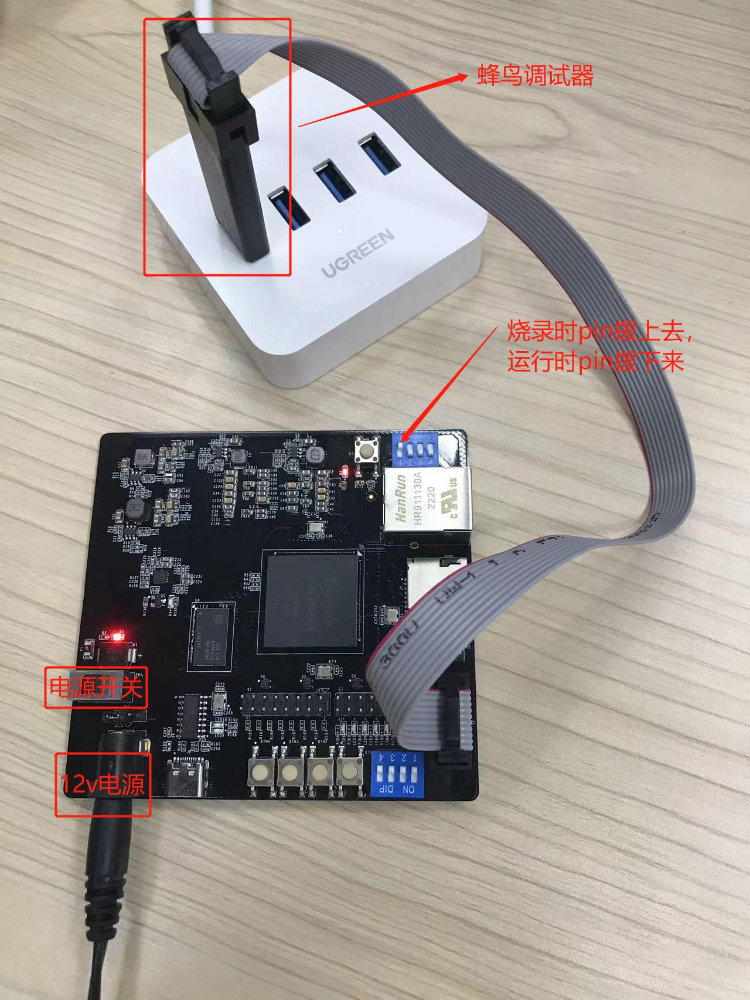
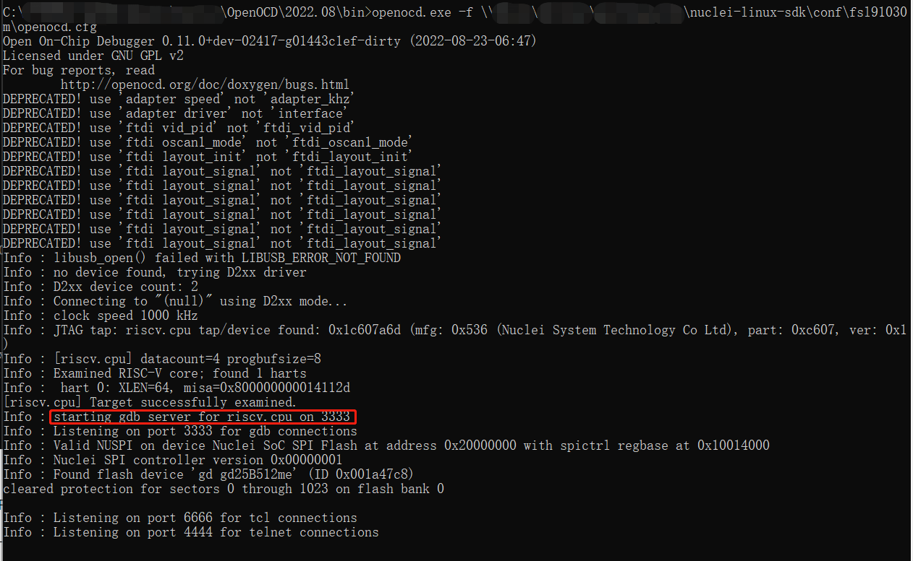
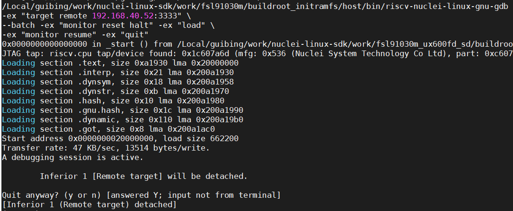

# FSL91030M 开发板使用说明

## Linux SDK编译

### 编译命令

典型的SD卡启动编译命令如下：

``make SOC=fsl91030m CORE=ux600fd BOOT_MODE=sd freeloader``

``make SOC=fsl91030m CORE=ux600fd BOOT_MODE=sd bootimages``

典型的flash only启动编译命令如下：

``make SOC=fsl91030m CORE=ux600fd BOOT_MODE=flash freeloader``

**其中各配置参数：**

- SOC参数：固定为fsl91030m，表示这款SOC芯片；

- CORE参数：ux600 或者ux600fd, ux600不支持硬件浮点，如要支持浮点，应配置为ux600fd，如编译过程需要改CORE参数，则要先make clean，然后继续编译。

- BOOT_MODE ：sd 卡或者flash，sd表示kernel和rootfs存放在sd卡上，启动时会从sd卡读取kernel，rootfs完成系统启动.
  flash表示kernel，rootfs存放在norflash上，启动时从norflash 读取kernel，rootfs完成系统启动。
  如编译过程需要改BOOT_MODE 参数，要先cleanuboot， 然后继续编译。

关于详细的使用说明请参见[Linux SDK主文档](../../README.md)

目前该款芯片不支持QEMU/XLSPIKE仿真，所以QEMU/XLSPIKE相关功能无法使用。

### 编译输出

编译后生成的运行文件位置在 `SDK_DIR/work/fsl91030m/` 目录，目录结构如下：

~~~shell
.
├── boot
│   ├── boot.scr
│   ├── uImage.lz4
│   └── uInitrd.lz4
├── boot.zip
├── buildroot_initramfs
├── buildroot_initramfs_sysroot
├── freeloader
│   ├── freeloader.elf
├── initramfs.cpio.gz
├── initramfs.cpio.gz.lz4
├── linux
├── nuclei_rv64imafdc.dtb
├── nuclei_rv64imafdc.dts.preprocessed
├── opensbi
└── u-boot
~~~

freeloader.elf 在freeloader目录，kernel，rootfs 在boot 目录。

如果是sd卡启动，需要拷贝 `boot.src/uImage.lz4/uInitrd.lz4` 三个文件到sd卡；

如果是flash启动，则只需要烧录freeloader.elf 文件就够了，因为kernel，rootfs都合并到freeloader.elf 中了。

## Linux SDK 烧录

- 硬件：需要蜂鸟调试器，需要把FSL91030M开发板上靠近网口的pin1 朝外拨, 蜂鸟调试器会自带串口功能，默认使用此串口。

- 软件：先运行openocd 开启gdb server，然后使用upload_freeloader 命令将freeloader 烧录到norflash中。

**以window上烧录为例**

1) windows系统上先运行openocd （请使用最新的2022.08版本）

~~~shell
openocd.exe -f  linux-sdk\conf\fsl91030m\openocd.cfg
~~~

2) 在linux上执行upload_freeloader 命令

``make SOC=fsl91030m CORE=ux600fd BOOT_MODE=sd GDBREMOTE="192.168.40.52:3333" upload_freeloader``

> 注意: `GDBREMOTE="192.168.40.52:3333"` 需要根据实际的PC IP来确定，如果均是在Linux环境下下载程序，则不需要额外指定，也不需要从windows上起openocd

上述是BOOT_MODE=sd，如从flash启动kernel，则改为BOOT_MODE=flash

GDBREMOTE 是运行openocd主机的ip地址和端口号

其主要打印如下图

**注意**：

**烧录前pin1 朝外拨。**

如kernel rootfs 放norflash上，烧录时间会长一点，需要耐心等待一下。

## Linux SDK 运行

运行前需要把FSL91030M开发板上靠近网口的pin1 朝内拨，否则无法启动！！！
如BOOT_MODE=sd 卡方式编译，则需要拷贝SDK_DIR/work/fsl91030m/boot下的三个文件boot.scr，uImage.lz4, uInitrd.lz4 到TF卡，TF卡插入板子，上电就可以启动。

如BOOT_MODE=flash方式编译，上电就可以启动系统，flash启动会比较慢点，需要等待一下才能看到串口打印。蜂鸟调试器自带串口，使用此串口可看到启动信息。

**注意：运行前pin1 朝内拨。**

## 注意事项

开发板上的 pin1 控制的是CPU里面的SRAM是当做Local Memory使用还是Cache使用，切换模式请断电重启。
- pin1 外拨： 选择当做Local Memory模式
- pin1 内拨： 选择当做Cache模式

当需要使用到openocd+gdb下载程序时，openocd需要有一块working memory用于flash下载，所以需要将SRAM设置到Local Memory模式。

而当flash下载完毕后，linux启动则需要将SRAM当做Cache使用，也就需要将SRAM设置到Cache模式。
