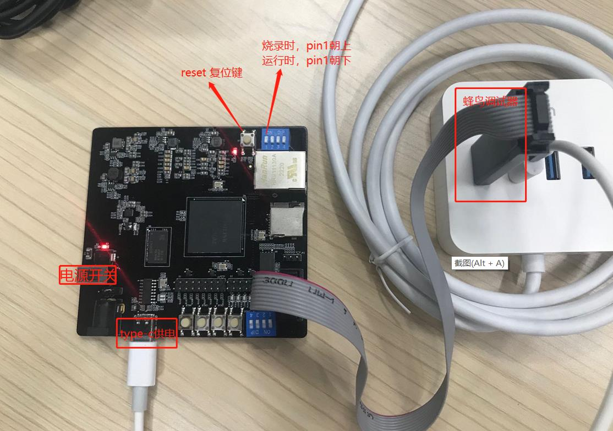

# FSL91030M 开发板使用说明

## Linux SDK编译

### 设置环境获取代码

按照主文档获取最新的Linux SDK代码，并且切换到 `feature/fsl` 分支

~~~shell
# Assume you are already in Nuclei Linux SDK git workspace
git fetch origin
git checkout feature/fsl
git submodule update
# 请确保git代码均已checkout对应的代码
git status
~~~

执行 `git submodule`查看对应的子仓库和github上的commit能否对应上。

### 编译命令

典型的SD卡启动编译命令如下：

``make SOC=fsl91030m CORE=ux600fd BOOT_MODE=sd freeloader``

``make SOC=fsl91030m CORE=ux600fd BOOT_MODE=sd bootimages``

典型的flash only启动编译命令如下：

``make SOC=fsl91030m CORE=ux600fd BOOT_MODE=flash freeloader``

**其中各配置参数：**

- SOC参数：固定为fsl91030m，表示这款SOC芯片；

- CORE参数：ux600 或者ux600fd, ux600不支持硬件浮点，如要支持浮点，应配置为ux600fd，如编译过程需要改CORE参数，则要先make clean，然后继续编译。

- BOOT_MODE ：sd 卡或者flash，sd表示kernel和rootfs存放在sd卡上，启动时会从sd卡读取kernel，rootfs完成系统启动.
  flash表示kernel，rootfs存放在norflash上，启动时从norflash 读取kernel，rootfs完成系统启动。
  如编译过程需要改BOOT_MODE 参数，要先cleanuboot， 然后继续编译。

关于详细的使用说明请参见[Linux SDK主文档](../../README.md)

目前该款芯片不支持QEMU/XLSPIKE仿真，所以QEMU/XLSPIKE相关功能无法使用。

### 编译输出

编译后生成的运行文件位置在 `SDK_DIR/work/fsl91030m/` 目录，目录结构如下：

~~~shell
.
├── boot
│   ├── boot.scr
│   ├── uImage.lz4
│   └── uInitrd.lz4
├── boot.zip
├── buildroot_initramfs
├── buildroot_initramfs_sysroot
├── freeloader
│   ├── freeloader.elf
├── initramfs.cpio.gz
├── initramfs.cpio.gz.lz4
├── linux
├── nuclei_rv64imafdc.dtb
├── nuclei_rv64imafdc.dts.preprocessed
├── opensbi
└── u-boot
~~~

freeloader.elf 在freeloader目录，kernel，rootfs 在boot 目录。

如果是sd卡启动，需要拷贝 `boot.src/uImage.lz4/uInitrd.lz4` 三个文件到sd卡；

如果是flash启动，则只需要烧录freeloader.elf 文件就够了，因为kernel，rootfs都合并到freeloader.elf 中了。

## Linux SDK 烧录

- 硬件：需要蜂鸟调试器，需要把FSL91030M开发板上靠近网口的pin1 朝外拨, 蜂鸟调试器会自带串口功能，默认使用此串口。

- 软件：先运行openocd 开启gdb server，然后使用upload_freeloader 命令将freeloader 烧录到norflash中。

**以window上烧录为例**

1) windows系统上先运行openocd （请使用最新的2022.08版本）

~~~shell
openocd.exe -f  linux-sdk\conf\fsl91030m\openocd.cfg
~~~

2) 在linux上执行upload_freeloader 命令

``make SOC=fsl91030m CORE=ux600fd BOOT_MODE=sd GDBREMOTE="192.168.40.52:3333" upload_freeloader``

> 注意: `GDBREMOTE="192.168.40.52:3333"` 需要根据实际的PC IP来确定，如果均是在Linux环境下下载程序，则不需要额外指定，也不需要从windows上起openocd

上述是BOOT_MODE=sd，如从flash启动kernel，则改为BOOT_MODE=flash

GDBREMOTE 是运行openocd主机的ip地址和端口号

其主要打印如下图

**注意**：

**烧录前pin1 朝外拨。**

如kernel rootfs 放norflash上，烧录时间会长一点，需要耐心等待一下。

## Linux SDK 运行

运行前需要把FSL91030M开发板上靠近网口的pin1 朝内拨，否则无法启动！！！

如BOOT_MODE=sd 卡方式编译，则需要拷贝SDK_DIR/work/fsl91030m/boot下的三个文件boot.scr，uImage.lz4, uInitrd.lz4 到TF卡(fat32格式)，TF卡插入板子，上电就可以启动。

如BOOT_MODE=flash方式编译，上电就可以启动系统，flash启动会比较慢点，需要等待一下才能看到串口打印。蜂鸟调试器自带串口，使用此串口可看到启动信息。

> - 串口波特率配置为 115200bps, Data 8bit, Parity None, Stop Bits 1bit, No Flow Control
> - Linux登录用户名/密码为：root/nuclei

**注意：运行前pin1 朝内拨。**

## 注意事项

开发板上的 pin1 控制的是CPU里面的SRAM是当做Local Memory使用还是Cache使用，切换模式请断电重启。
- pin1 外拨： 选择当做Local Memory模式
- pin1 内拨： 选择当做Cache模式

当需要使用到openocd+gdb下载程序时，openocd需要有一块working memory用于flash下载，所以需要将SRAM设置到Local Memory模式。

而当flash下载完毕后，linux启动则需要将SRAM当做Cache使用，也就需要将SRAM设置到Cache模式。

## 参考输出

以下参考输出是针对 `CORE=ux600fd BOOT_MODE=sd`场景下正常启动过程中输出：

~~~shell
OpenSBI v0.9
   ____                    _____ ____ _____
  / __ \                  / ____|  _ \_   _|
 | |  | |_ __   ___ _ __ | (___ | |_) || |
 | |  | | '_ \ / _ \ '_ \ \___ \|  _ < | |
 | |__| | |_) |  __/ | | |____) | |_) || |_
  \____/| .__/ \___|_| |_|_____/|____/_____|
        | |
        |_|

Platform Name             : Nuclei UX600
Platform Features         : timer,mfdeleg
Platform HART Count       : 1
Firmware Base             : 0x40000000
Firmware Size             : 84 KB
Runtime SBI Version       : 0.2

Domain0 Name              : root
Domain0 Boot HART         : 0
Domain0 HARTs             : 0*
Domain0 Region00          : 0x0000000040000000-0x000000004001ffff ()
Domain0 Region01          : 0x0000000000000000-0xffffffffffffffff (R,W,X)
Domain0 Next Address      : 0x0000000040200000
Domain0 Next Arg1         : 0x0000000048000000
Domain0 Next Mode         : S-mode
Domain0 SysReset          : yes

Boot HART ID              : 0
Boot HART Domain          : root
Boot HART ISA             : rv64imafdcsu
Boot HART Features        : scounteren,mcounteren,time
Boot HART PMP Count       : 16
Boot HART PMP Granularity : 4096
Boot HART PMP Address Bits: 30
Boot HART MHPM Count      : 0
Boot HART MHPM Count      : 0
Boot HART MIDELEG         : 0x0000000000000222
Boot HART MEDELEG         : 0x000000000000b109

U-Boot 2021.01-00020-gaa059e0738 (Aug 29 2022 - 22:22:53 +0800)

CPU:   rv64imafdc
Model: nuclei,fsl91030m
DRAM:  256 MiB
Board: Initialized
MMC:   Nuclei SPI version 0x1
spi@10016000:mmc@1: 0
In:    console
Out:   console
Err:   console
Net:   No ethernet found.
Hit any key to stop autoboot:  0
switch to partitions #0, OK
mmc0 is current device
Scanning mmc 0:1...
Found U-Boot script /boot.scr
408 bytes read in 375 ms (1000 Bytes/s)
## Executing script at 40200000
Loading kernel
4025440 bytes read in 22115 ms (177.7 KiB/s)
Loading ramdisk
5487648 bytes read in 30011 ms (177.7 KiB/s)
kernel.dtb not found, ignore it
Starts booting from SD
## Booting kernel from Legacy Image at 41000000 ...
   Image Name:   Linux
   Image Type:   RISC-V Linux Kernel Image (lz4 compressed)
   Data Size:    4025376 Bytes = 3.8 MiB
   Load Address: 40400000
   Entry Point:  40400000
   Verifying Checksum ... OK
## Loading init Ramdisk from Legacy Image at 48300000 ...
   Image Name:   Initrd
   Image Type:   RISC-V Linux RAMDisk Image (lz4 compressed)
   Data Size:    5487584 Bytes = 5.2 MiB
   Load Address: 00000000
   Entry Point:  00000000
   Verifying Checksum ... OK
## Flattened Device Tree blob at 48000000
   Booting using the fdt blob at 0x48000000
   Uncompressing Kernel Image
   Using Device Tree in place at 0000000048000000, end 00000000480041b0

Starting kernel ...

[    0.000000] Linux version 5.10.0+ (guibing@whss1.corp.nucleisys.com) (riscv-nuclei-linux-gnu-gcc (GCC) 10.2.0, GNU ld (GNU Binutils) 2.36.1) #1 SMP Mon Aug 29 22:27:02 CST 2022
[    0.000000] OF: fdt: Ignoring memory range 0x40000000 - 0x40400000
[    0.000000] earlycon: sbi0 at I/O port 0x0 (options '')
[    0.000000] printk: bootconsole [sbi0] enabled
[    0.000000] efi: UEFI not found.
[    0.000000] Initial ramdisk at: 0x(____ptrval____) (5488640 bytes)
[    0.000000] Zone ranges:
[    0.000000]   DMA32    [mem 0x0000000040400000-0x000000004fffffff]
[    0.000000]   Normal   empty
[    0.000000] Movable zone start for each node
[    0.000000] Early memory node ranges
[    0.000000]   node   0: [mem 0x0000000040400000-0x000000004fffffff]
[    0.000000] Initmem setup node 0 [mem 0x0000000040400000-0x000000004fffffff]
[    0.000000] software IO TLB: mapped [mem 0x000000004bc88000-0x000000004fc88000] (64MB)
[    0.000000] SBI specification v0.2 detected
[    0.000000] SBI implementation ID=0x1 Version=0x9
[    0.000000] SBI v0.2 TIME extension detected
[    0.000000] SBI v0.2 IPI extension detected
[    0.000000] SBI v0.2 RFENCE extension detected
[    0.000000] SBI v0.2 HSM extension detected
[    0.000000] riscv: ISA extensions acdfim
[    0.000000] riscv: ELF capabilities acdfim
[    0.000000] percpu: Embedded 16 pages/cpu s25112 r8192 d32232 u65536
[    0.000000] Built 1 zonelists, mobility grouping on.  Total pages: 63630
[    0.000000] Kernel command line: earlycon=sbi console=ttyNUC0
[    0.000000] Dentry cache hash table entries: 32768 (order: 6, 262144 bytes, linear)
[    0.000000] Inode-cache hash table entries: 16384 (order: 5, 131072 bytes, linear)
[    0.000000] Sorting __ex_table...
[    0.000000] mem auto-init: stack:off, heap alloc:off, heap free:off
[    0.000000] Memory: 169412K/258048K available (4716K kernel code, 4149K rwdata, 2048K rodata, 192K init, 329K bss, 88636K reserved, 0K cma-reserved)
[    0.000000] SLUB: HWalign=64, Order=0-3, MinObjects=0, CPUs=1, Nodes=1
[    0.000000] rcu: Hierarchical RCU implementation.
[    0.000000] rcu: 	RCU restricting CPUs from NR_CPUS=8 to nr_cpu_ids=1.
[    0.000000] rcu: RCU calculated value of scheduler-enlistment delay is 10 jiffies.
[    0.000000] rcu: Adjusting geometry for rcu_fanout_leaf=16, nr_cpu_ids=1
[    0.000000] NR_IRQS: 64, nr_irqs: 64, preallocated irqs: 0
[    0.000000] riscv-intc: 64 local interrupts mapped
[    0.000000] plic: interrupt-controller@8000000: mapped 53 interrupts with 1 handlers for 2 contexts.
[    0.000000] random: get_random_bytes called from 0xffffffe00000295c with crng_init=0
[    0.000000] riscv_timer_init_dt: Registering clocksource cpuid [0] hartid [0]
[    0.000000] clocksource: riscv_clocksource: mask: 0xffffffffffffffff max_cycles: 0x171021082, max_idle_ns: 56421785891809 ns
[    0.000122] sched_clock: 64 bits at 48kHz, resolution 20480ns, wraps every 70368744174335ns
[    0.010178] Calibrating delay loop (skipped), value calculated using timer frequency.. 0.09 BogoMIPS (lpj=488)
[    0.020480] pid_max: default: 32768 minimum: 301
[    0.031826] Mount-cache hash table entries: 512 (order: 0, 4096 bytes, linear)
[    0.038850] Mountpoint-cache hash table entries: 512 (order: 0, 4096 bytes, linear)
[    0.094105] rcu: Hierarchical SRCU implementation.
[    0.104653] EFI services will not be available.
[    0.112169] smp: Bringing up secondary CPUs ...
[    0.116388] smp: Brought up 1 node, 1 CPU
[    0.130539] devtmpfs: initialized
[    0.183194] clocksource: jiffies: mask: 0xffffffff max_cycles: 0xffffffff, max_idle_ns: 19112604462750000 ns
[    0.193290] futex hash table entries: 256 (order: 2, 16384 bytes, linear)
[    0.202813] pinctrl core: initialized pinctrl subsystem
[    0.215941] NET: Registered protocol family 16
[    0.527914] clocksource: Switched to clocksource riscv_clocksource
[    0.568219] NET: Registered protocol family 2
[    0.588924] tcp_listen_portaddr_hash hash table entries: 256 (order: 0, 4096 bytes, linear)
[    0.598099] TCP established hash table entries: 2048 (order: 2, 16384 bytes, linear)
[    0.609076] TCP bind hash table entries: 2048 (order: 3, 32768 bytes, linear)
[    0.619398] TCP: Hash tables configured (established 2048 bind 2048)
[    0.627693] UDP hash table entries: 256 (order: 1, 8192 bytes, linear)
[    0.634963] UDP-Lite hash table entries: 256 (order: 1, 8192 bytes, linear)
[    0.647292] NET: Registered protocol family 1
[    0.667834] RPC: Registered named UNIX socket transport module.
[    0.673425] RPC: Registered udp transport module.
[    0.678667] RPC: Registered tcp transport module.
[    0.683030] RPC: Registered tcp NFSv4.1 backchannel transport module.
[    0.699250] Trying to unpack rootfs image as initramfs...
[    4.425555] Freeing initrd memory: 5352K
[    4.440607] workingset: timestamp_bits=62 max_order=16 bucket_order=0
[    4.723068] jffs2: version 2.2. (NAND) © 2001-2006 Red Hat, Inc.
[    4.751863] JFS: nTxBlock = 1365, nTxLock = 10922
[    5.038133] NET: Registered protocol family 38
[    5.042844] Block layer SCSI generic (bsg) driver version 0.4 loaded (major 253)
[    5.050544] io scheduler mq-deadline registered
[    5.054763] io scheduler kyber registered
[    6.272057] 10013000.serial: ttyNUC0 at MMIO 0x10013000 (irq = 1, base_baud = 6250000) is a Nuclei UART/USART
[    6.282460] printk: console [ttyNUC0] enabled
[    6.282460] printk: console [ttyNUC0] enabled
[    6.291185] printk: bootconsole [sbi0] disabled
[    6.291185] printk: bootconsole [sbi0] disabled
[    6.588678] brd: module loaded
[    6.747132] loop: module loaded
[    6.755959] nuclei_spi 10014000.spi: mapped; irq=2, cs=4
[    6.792803] spi-nor spi0.1: gd25b512 (65536 Kbytes)
[    6.888957] random: fast init done
[    8.835954] ftl_cs: FTL header not found.
[    8.861554] nuclei_spi 10016000.spi: mapped; irq=4, cs=4
[    8.900999] libphy: Fixed MDIO Bus: probed
[    8.958118] mmc_spi spi1.1: SD/MMC host mmc0, no DMA, no WP, no poweroff, cd polling
[    8.974625] ipip: IPv4 and MPLS over IPv4 tunneling driver
[    9.013168] NET: Registered protocol family 10
[    9.055500] Segment Routing with IPv6
[    9.061931] sit: IPv6, IPv4 and MPLS over IPv4 tunneling driver
[    9.085524] NET: Registered protocol family 17
[    9.119931] Freeing unused kernel memory: 192K
[    9.125972] Run /init as init process
[    9.347956] mmc0: error -110 whilst initialising SD card
Starting syslogd: OK
Starting klogd: [   11.447919] mmc0: error -110 whilst initialising MMC card
OK
Running sysctl: OK
[   12.791594] mmc0: host does not support reading read-only switch, assuming write-enable
[   12.799787] mmc0: new SDHC card on SPI
[   12.859486] mmcblk0: mmc0:0000 USD00 7.48 GiB
[   12.935938]  mmcblk0: p1
Starting mdev... OK
modprobe: can't change directory to '/lib/modules': No such file or directory
Saving random seed: [   40.252703] random: dd: uninitialized urandom read (512 bytes read)
OK

Welcome to Nuclei System Technology
nucleisys login: root
Password:
#
~~~
