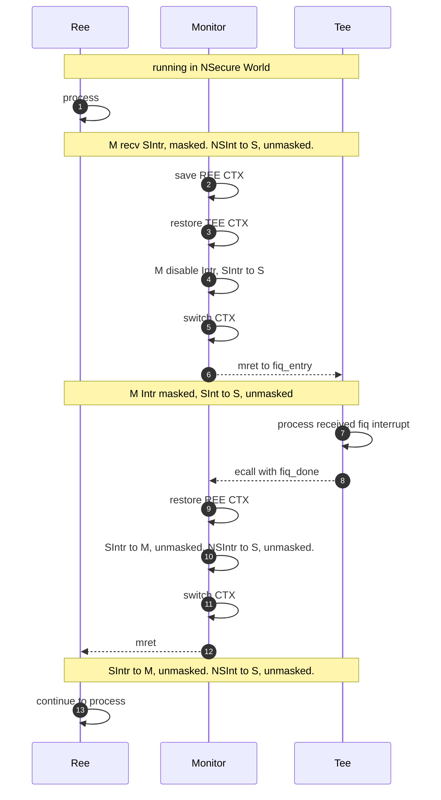

# OPTEE Description

This document explains the OPTEE implementation related to RISC-V architecture, not the basic principle of OPTEE, please refer to the official document for the basic principle of OPTEE(http://optee.readthedocs.io/).

Our optee software implementations based on riscv are basically same with ARM, divided into two worlds: the secure world (TEE) and the non-secure world (REE).The two worlds are isolated from each other, including code execution isolation, interrupt isolation. At present, single-core and multi-core are supported. When the CPU is executed in TEE, it cannot be interrupted by non-security interrupts. The CPU can be interrupted by security interrupts during REE execution. In addition, the Linux SDK branch with _wg postfix already supports NUCLEI 900 serial CPU hardware security bits, which change when worlds are switched. This security bit can be reflected on the system bus. Currently,our solution of interrupt management requires that the PLIC interrupt controller pending bits can be written in M mode.

## Boot Flow

optee-os will be load by freeloader from norflash to DRAM,  opensbi initializes optee. After initialization, opensbi continues to boot uboot, uboot startup linux to system console.

## System Architecture

RISC-V OPTEE system architecture:


The TEE is separated from the running address space of REE by PMP, and the interrupt isolation is realized through the switch of PLIC interrupt enable mode, that is, the secure interrupt is processed in the secure world, and the non-secure interrupt is processed in the non-secure world, and the interrupt that does not belong to the processing of this world needs to be forwarded to another world through M mode.Currently when cpu in TEE, M mode interrupt is disabled.

## Interrupt Management

To distinguish between secure and non-secure interrupts, Setting interrupts that are not handled by the current world to M mode, while interrupts handled by the current world will be set to Smode.
When the cpu executes in the secure world, M-mode interrupts are turned off (including Timer, Software, PLIC) and S-mode PLIC interrupts are enabled. PLIC interrupts will directly trap to the secure world, and non-secure interrupts cannot interrupt their execution.
A security interrupt can interrupt non-secure world execution with the following flowchart:
REE is Nonsecure software stack, like Linux os and its app;
Monitor is Secure Monitor, like riscv opensbi;
TEE is Secure software stack, like OPTEE;



## Secure PLIC interrupt configuration

We use a table to record which plic device interrupts are secure, which are non-secure。Monitor will set
interrupt enable mode depending on next world secure state. For example, before cpu entering into REE, Monitor will set secure plic interrupt enable mode to M, non-secure plic interrupt to S. otherwise, before entering into TEE, Monitor will set secure plic interrupt enable mode to S, non-secure plic interrupt enable mode to M.
Currently Monitor use plic_secure_int array to save secure plic interrupt information, each element of array include hart and secure interrupt number, high 16bit represent hart id, low 16bit represent interrupt number.The plic_secure_int [0] is a special value that records the total number of interrupts.

- plic_secure_int[0]：Indicates that there are plic_secure_int[0] & 0xFFFF security interrupts.
- plic_secure_int[x]：Indicates (plic_secure_int[x] & 0xFFFF) secure interrupt is bound to (plic_secure_int[x] >> 16) hart.

Secure interrupt and non-Secure interrupt needs to be designed at the system startup to avoid conflicts.

OPTEE-OS use sbi_register_secure_intr(int intr) function to ecall to Monitor to register secure interrupt.

there is a register secure timer interrupt demo:

optee_os/core/pta/nuclei/timer.c 
```c
static TEE_Result pta_timer_set_timeout(uint32_t param_types,
				     TEE_Param params[TEE_NUM_PARAMS])
{

	uint32_t timeout1 = 0;
	uint32_t exp_param_types;
	static int flag = 0;

	/* register secure timer interrupt int38*/
	if (flag == 0) {
		flag = 1;
		sbi_register_secure_intr(38);
	}

	exp_param_types = TEE_PARAM_TYPES(TEE_PARAM_TYPE_VALUE_INPUT,
						   TEE_PARAM_TYPE_VALUE_INPUT,
						   TEE_PARAM_TYPE_NONE,
						   TEE_PARAM_TYPE_NONE);

	if (exp_param_types != param_types) {
		EMSG("Invalid Param types");
		return TEE_ERROR_BAD_PARAMETERS;
	}

	timeout1 = params[0].value.a;
	if (timer_base == 0)
		timer_base = core_mmu_get_va(SEC_TIMER_BASE, MEM_AREA_IO_SEC,
	                   SEC_TIMER_SIZE);

	*(volatile unsigned int*)timer_base = timeout1;

	return TEE_SUCCESS;
}

```

## Compile and Depoly

optee compilation include optee-os, optee-client, optee-test, optee-example, have been integrated into top Mafile of Linux SDK. it will finish compile when build linux sdk. 

general linux SDK compile command as flow:

```makefile
make SOC=evalsoc CORE=ux900fd BOOT_MODE=sd freeloader
make SOC=evalsoc CORE=ux900fd BOOT_MODE=sd bootimages
```

tee-supplicant and libteec program generated after compiling optee-client will be installed to the rootfs.
ta app, ca app, plugin program generated after compiling optee-test will be installed to the rootfs.

more detail compile info please refer to top Makfile.

The TEE driver and optee dts node needs to be configured for linux, so that the OPTEE driver can be loaded upon startup.

## Start and Running log

The following log includes the startup process of the SMP system and running two client application (CA) applications：optee_example_hello_world,optee_example_demo.

- user name：root

- password：nuclei

```
[2023/06/16-12:05:50:699] 
[2023/06/16-12:05:50:699] OpenSBI v0.9
[2023/06/16-12:05:50:699]    ____                    _____ ____ _____
[2023/06/16-12:05:50:699]   / __ \                  / ____|  _ \_   _|
[2023/06/16-12:05:50:721]  | |  | |_ __   ___ _ __ | (___ | |_) || |
[2023/06/16-12:05:50:721]  | |  | | '_ \ / _ \ '_ \ \___ \|  _ < | |
[2023/06/16-12:05:50:721]  | |__| | |_) |  __/ | | |____) | |_) || |_
[2023/06/16-12:05:50:736]   \____/| .__/ \___|_| |_|_____/|____/_____|
[2023/06/16-12:05:50:736]         | |
[2023/06/16-12:05:50:736]         |_|
[2023/06/16-12:05:50:736] 
[2023/06/16-12:05:50:954] Platform Name             : Nuclei Evaluation SoC
[2023/06/16-12:05:50:954] Platform Features         : timer,mfdeleg
[2023/06/16-12:05:50:954] Platform HART Count       : 8
[2023/06/16-12:05:50:970] Firmware Base             : 0xa0000000
[2023/06/16-12:05:50:970] Firmware Size             : 188 KB
[2023/06/16-12:05:50:970] Runtime SBI Version       : 0.2
[2023/06/16-12:05:50:970] 
[2023/06/16-12:05:50:976] Domain0 Name              : root
[2023/06/16-12:05:50:976] Domain0 Boot HART         : 0
[2023/06/16-12:05:50:976] Domain0 HARTs             : 0*,1*,2*,3*,4*,5*,6*,7*
[2023/06/16-12:05:50:991] Domain0 Region00          : 0x00000000a0000000-0x00000000a003ffff ()
[2023/06/16-12:05:50:991] Domain0 Region01          : 0x0000000000000000-0xffffffffffffffff (R,W,X)
[2023/06/16-12:05:50:997] Domain0 Next Address      : 0x00000000a1000000
[2023/06/16-12:05:50:997] Domain0 Next Arg1         : 0x00000000a8000000
[2023/06/16-12:05:50:997] Domain0 Next Mode         : S-mode
[2023/06/16-12:05:51:013] Domain0 SysReset          : yes
[2023/06/16-12:05:51:013] 
[2023/06/16-12:05:51:040] [SM] Initializing ... hart [0]
[2023/06/16-12:05:51:040] I/TC: 
[2023/06/16-12:05:51:056] I/TC: OP-TEE version: 80ac73cea-dev (gcc version 10.2.0 (GCC)) #1 Fri Jun 16 03:59:20 UTC 2023 riscv
[2023/06/16-12:05:51:056] I/TC: WARNING: This OP-TEE configuration might be insecure!
[2023/06/16-12:05:51:061] I/TC: WARNING: Please check https://optee.readthedocs.io/en/latest/architecture/porting_guidelines.html
[2023/06/16-12:05:51:061] I/TC: Primary CPU initializing
[2023/06/16-12:05:51:061] I/TC: Primary CPU switching to normal world boot
[2023/06/16-12:05:51:077] [SM] security monitor has been initialized!
[2023/06/16-12:05:51:077] Boot HART ID              : 0
[2023/06/16-12:05:51:077] Boot HART Domain          : root
[2023/06/16-12:05:51:082] Boot HART ISA             : rv64imafdcbsu
[2023/06/16-12:05:51:082] Boot HART Features        : scounteren,mcounteren,time
[2023/06/16-12:05:51:082] Boot HART PMP Count       : 16
[2023/06/16-12:05:51:098] Boot HART PMP Granularity : 4096
[2023/06/16-12:05:51:104] Boot HART PMP Address Bits: 30
[2023/06/16-12:05:51:104] Boot HART MHPM Count      : 0
[2023/06/16-12:05:51:104] Boot HART MHPM Count      : 0
[2023/06/16-12:05:51:104] Boot HART MIDELEG         : 0x0000000000000222
[2023/06/16-12:05:51:119] Boot HART MEDELEG         : 0x000000000000b109
[2023/06/16-12:05:51:226] 
[2023/06/16-12:05:51:226] 
[2023/06/16-12:05:51:226] U-Boot 2021.01-gb9162c6c (Jun 16 2023 - 12:04:19 +0800)
[2023/06/16-12:05:51:226] 
[2023/06/16-12:05:51:226] CPU:   rv64imafdc
[2023/06/16-12:05:51:226] Model: nuclei,evalsoc
[2023/06/16-12:05:51:226] DRAM:  1.5 GiB
[2023/06/16-12:05:51:311] Board: Initialized
[2023/06/16-12:05:51:353] MMC:   Nuclei SPI version 0xee010102
[2023/06/16-12:05:51:353] spi@10034000:mmc@0: 0
[2023/06/16-12:05:51:380] In:    serial@10013000
[2023/06/16-12:05:51:380] Out:   serial@10013000
[2023/06/16-12:05:51:380] Err:   serial@10013000
[2023/06/16-12:05:51:380] Net:   No ethernet found.
[2023/06/16-12:05:53:445] Hit any key to stop autoboot:  0 
[2023/06/16-12:05:53:445] switch to partitions #0, OK
[2023/06/16-12:05:53:445] mmc0 is current device
[2023/06/16-12:05:53:481] Scanning mmc 0:1...
[2023/06/16-12:05:53:972] Found U-Boot script /boot.scr
[2023/06/16-12:05:54:305] 725 bytes read in 306 ms (2 KiB/s)
[2023/06/16-12:05:54:305] ## Executing script at a1000000
[2023/06/16-12:05:54:305] Boot images located in .
[2023/06/16-12:05:54:305] Loading kernel: ./uImage.lz4
[2023/06/16-12:06:12:026] 4014329 bytes read in 17574 ms (222.7 KiB/s)
[2023/06/16-12:06:12:026] Loading ramdisk: ./uInitrd.lz4
[2023/06/16-12:06:46:381] 7860656 bytes read in 34118 ms (224.6 KiB/s)
[2023/06/16-12:06:46:529] ./kernel.dtb not found, ignore it
[2023/06/16-12:06:46:529] Starts booting from SD
[2023/06/16-12:06:46:529] ## Booting kernel from Legacy Image at a2000000 ...
[2023/06/16-12:06:46:545]    Image Name:   Linux
[2023/06/16-12:06:46:545]    Image Type:   RISC-V Linux Kernel Image (lz4 compressed)
[2023/06/16-12:06:46:545]    Data Size:    4014265 Bytes = 3.8 MiB
[2023/06/16-12:06:46:587]    Load Address: a1200000
[2023/06/16-12:06:46:587]    Entry Point:  a1200000
[2023/06/16-12:06:47:317]    Verifying Checksum ... OK
[2023/06/16-12:06:47:317] ## Loading init Ramdisk from Legacy Image at a9300000 ...
[2023/06/16-12:06:47:317]    Image Name:   Initrd
[2023/06/16-12:06:47:338]    Image Type:   RISC-V Linux RAMDisk Image (lz4 compressed)
[2023/06/16-12:06:47:338]    Data Size:    7860592 Bytes = 7.5 MiB
[2023/06/16-12:06:47:338]    Load Address: 00000000
[2023/06/16-12:06:47:338]    Entry Point:  00000000
[2023/06/16-12:06:48:914]    Verifying Checksum ... OK
[2023/06/16-12:06:48:914] ## Flattened Device Tree blob at a8000000
[2023/06/16-12:06:48:914]    Booting using the fdt blob at 0xa8000000
[2023/06/16-12:06:48:914]    Uncompressing Kernel Image
[2023/06/16-12:06:53:394]    Using Device Tree in place at 00000000a8000000, end 00000000a80046bb
[2023/06/16-12:06:53:394] 
[2023/06/16-12:06:53:394] Starting kernel ...
[2023/06/16-12:06:53:394] 
[2023/06/16-12:06:53:402] [    0.000000] Linux version 5.10.0+ (guibing@whml1.corp.nucleisys.com) (riscv-nuclei-linux-gnu-gcc (GCC) 10.2.0, GNU ld (GNU Binutils) 2.36.1) #3 SMP Fri Jun 16 12:01:57 CST 2023
[2023/06/16-12:06:53:423] [    0.000000] OF: fdt: Ignoring memory range 0xa1000000 - 0xa1200000
[2023/06/16-12:06:53:423] [    0.000000] earlycon: sbi0 at I/O port 0x0 (options '')
[2023/06/16-12:06:53:439] [    0.000000] printk: bootconsole [sbi0] enabled
[2023/06/16-12:06:53:439] [    0.000000] efi: UEFI not found.
[2023/06/16-12:06:53:439] [    0.000000] Initial ramdisk at: 0x(____ptrval____) (7864320 bytes)
[2023/06/16-12:06:53:439] [    0.000000] Zone ranges:
[2023/06/16-12:06:53:444] [    0.000000]   DMA32    [mem 0x00000000a1200000-0x00000000fdffffff]
[2023/06/16-12:06:53:444] [    0.000000]   Normal   empty
[2023/06/16-12:06:53:444] [    0.000000] Movable zone start for each node
[2023/06/16-12:06:53:460] [    0.000000] Early memory node ranges
[2023/06/16-12:06:53:502] [    0.000000]   node   0: [mem 0x00000000a1200000-0x00000000fdffffff]
[2023/06/16-12:06:53:502] [    0.000000] Initmem setup node 0 [mem 0x00000000a1200000-0x00000000fdffffff]
[2023/06/16-12:06:53:979] [    0.000000] software IO TLB: mapped [mem 0x00000000f8b9f000-0x00000000fcb9f000] (64MB)
[2023/06/16-12:06:53:995] [    0.000000] SBI specification v0.2 detected
[2023/06/16-12:06:53:998] [    0.000000] SBI implementation ID=0x1 Version=0x9
[2023/06/16-12:06:53:998] [    0.000000] SBI v0.2 TIME extension detected
[2023/06/16-12:06:53:998] [    0.000000] SBI v0.2 IPI extension detected
[2023/06/16-12:06:54:013] [    0.000000] SBI v0.2 RFENCE extension detected
[2023/06/16-12:06:54:013] [    0.000000] SBI v0.2 HSM extension detected
[2023/06/16-12:06:54:013] [    0.000000] riscv: ISA extensions acdfim
[2023/06/16-12:06:54:034] [    0.000000] riscv: ELF capabilities acdfim
[2023/06/16-12:06:54:034] [    0.000000] percpu: Embedded 16 pages/cpu s25112 r8192 d32232 u65536
[2023/06/16-12:06:54:034] [    0.000000] Built 1 zonelists, mobility grouping on.  Total pages: 375215
[2023/06/16-12:06:54:061] [    0.000000] Kernel command line: earlycon=sbi console=ttyNUC0
[2023/06/16-12:06:54:061] [    0.000000] Dentry cache hash table entries: 262144 (order: 9, 2097152 bytes, linear)
[2023/06/16-12:06:54:061] [    0.000000] Inode-cache hash table entries: 131072 (order: 8, 1048576 bytes, linear)
[2023/06/16-12:06:54:120] [    0.000000] Sorting __ex_table...
[2023/06/16-12:06:54:120] [    0.000000] mem auto-init: stack:off, heap alloc:off, heap free:off
[2023/06/16-12:06:54:353] [    0.000000] Memory: 1410268K/1521664K available (4712K kernel code, 4139K rwdata, 2048K rodata, 188K init, 328K bss, 111396K reserved, 0K cma-reserved)
[2023/06/16-12:06:54:353] [    0.000000] SLUB: HWalign=64, Order=0-3, MinObjects=0, CPUs=8, Nodes=1
[2023/06/16-12:06:54:353] [    0.000000] rcu: Hierarchical RCU implementation.
[2023/06/16-12:06:54:359] [    0.000000] rcu: RCU calculated value of scheduler-enlistment delay is 10 jiffies.
[2023/06/16-12:06:54:359] [    0.000000] NR_IRQS: 64, nr_irqs: 64, preallocated irqs: 0
[2023/06/16-12:06:54:375] [    0.000000] riscv-intc: 64 local interrupts mapped
[2023/06/16-12:06:54:402] [    0.000000] plic: interrupt-controller@1c000000: mapped 53 interrupts with 8 handlers for 16 contexts.
[2023/06/16-12:06:54:402] [    0.000000] random: get_random_bytes called from 0xffffffe00000296a with crng_init=0
[2023/06/16-12:06:54:417] [    0.000000] riscv_timer_init_dt: Registering clocksource cpuid [0] hartid [0]
[2023/06/16-12:06:54:423] [    0.000000] clocksource: riscv_clocksource: mask: 0xffffffffffffffff max_cycles: 0x1ef4687b1, max_idle_ns: 112843571739654 ns
[2023/06/16-12:06:54:423] [    0.000061] sched_clock: 64 bits at 32kHz, resolution 30517ns, wraps every 70368744171142ns
[2023/06/16-12:06:54:439] [    0.009521] Calibrating delay loop (skipped), value calculated using timer frequency.. 0.06 BogoMIPS (lpj=327)
[2023/06/16-12:06:54:444] [    0.019256] pid_max: default: 32768 minimum: 301
[2023/06/16-12:06:54:460] [    0.025878] Mount-cache hash table entries: 4096 (order: 3, 32768 bytes, linear)
[2023/06/16-12:06:54:481] [    0.033050] Mountpoint-cache hash table entries: 4096 (order: 3, 32768 bytes, linear)
[2023/06/16-12:06:54:481] [    0.058105] rcu: Hierarchical SRCU implementation.
[2023/06/16-12:06:54:508] [    0.064422] EFI services will not be available.
[2023/06/16-12:06:54:508] [    0.072326] smp: Bringing up secondary CPUs ...
[2023/06/16-12:06:54:524] I/TC: Secondary CPU 1 initializing
[2023/06/16-12:06:54:524] I/TC: Secondary CPU 1 switching to normal world boot
[2023/06/16-12:06:54:545] I/TC: Secondary CPU 2 initializing
[2023/06/16-12:06:54:545] I/TC: Secondary CPU 2 switching to normal world boot
[2023/06/16-12:06:54:587] I/TC: Secondary CPU 3 initializing
[2023/06/16-12:06:54:587] I/TC: Secondary CPU 3 switching to normal world boot
[2023/06/16-12:06:55:611] [    1.148345] CPU4: failed to come online
[2023/06/16-12:06:56:647] [    2.191925] CPU5: failed to come online
[2023/06/16-12:06:57:705] [    3.236206] CPU6: failed to come online
[2023/06/16-12:06:58:754] [    4.280517] CPU7: failed to come online
[2023/06/16-12:06:58:754] [    4.284393] smp: Brought up 1 node, 4 CPUs
[2023/06/16-12:06:58:785] [    4.296234] devtmpfs: initialized
[2023/06/16-12:06:58:785] [    4.319610] clocksource: jiffies: mask: 0xffffffff max_cycles: 0xffffffff, max_idle_ns: 19112604462750000 ns
[2023/06/16-12:06:58:800] [    4.329193] futex hash table entries: 2048 (order: 5, 131072 bytes, linear)
[2023/06/16-12:06:58:843] [    4.339294] pinctrl core: initialized pinctrl subsystem
[2023/06/16-12:06:58:843] [    4.347503] NET: Registered protocol family 16
[2023/06/16-12:06:58:955] [    4.481170] clocksource: Switched to clocksource riscv_clocksource
[2023/06/16-12:06:58:955] [    4.501708] NET: Registered protocol family 2
[2023/06/16-12:06:58:976] [    4.514434] tcp_listen_portaddr_hash hash table entries: 1024 (order: 2, 16384 bytes, linear)
[2023/06/16-12:06:58:992] [    4.523101] TCP established hash table entries: 16384 (order: 5, 131072 bytes, linear)
[2023/06/16-12:06:58:992] [    4.533325] TCP bind hash table entries: 16384 (order: 6, 262144 bytes, linear)
[2023/06/16-12:06:58:997] [    4.545257] TCP: Hash tables configured (established 16384 bind 16384)
[2023/06/16-12:06:58:997] [    4.553039] UDP hash table entries: 1024 (order: 3, 32768 bytes, linear)
[2023/06/16-12:06:59:040] [    4.560058] UDP-Lite hash table entries: 1024 (order: 3, 32768 bytes, linear)
[2023/06/16-12:06:59:040] [    4.569976] NET: Registered protocol family 1
[2023/06/16-12:06:59:040] [    4.579040] RPC: Registered named UNIX socket transport module.
[2023/06/16-12:06:59:040] [    4.584686] RPC: Registered udp transport module.
[2023/06/16-12:06:59:040] [    4.589172] RPC: Registered tcp transport module.
[2023/06/16-12:06:59:098] [    4.594238] RPC: Registered tcp NFSv4.1 backchannel transport module.
[2023/06/16-12:06:59:098] [    4.603820] Trying to unpack rootfs image as initramfs...
[2023/06/16-12:07:03:203] [    8.693206] Freeing initrd memory: 7672K
[2023/06/16-12:07:03:203] [    8.706329] workingset: timestamp_bits=62 max_order=19 bucket_order=0
[2023/06/16-12:07:03:311] [    8.788848] jffs2: version 2.2. (NAND) 漏 2001-2006 Red Hat, Inc.
[2023/06/16-12:07:03:311] [    8.800598] JFS: nTxBlock = 8192, nTxLock = 65536
[2023/06/16-12:07:04:693] [   10.209747] NET: Registered protocol family 38
[2023/06/16-12:07:04:693] [   10.213958] io scheduler mq-deadline registered
[2023/06/16-12:07:04:708] [   10.218261] io scheduler kyber registered
[2023/06/16-12:07:05:247] [   10.747100] 10013000.serial: ttyNUC0 at MMIO 0x10013000 (irq = 1, base_baud = 3125000) is a Nuclei UART/USART
[2023/06/16-12:07:05:253] [   10.756896] printk: console [ttyNUC0] enabled
[2023/06/16-12:07:05:253] [   10.756896] printk: console [ttyNUC0] enabled
[2023/06/16-12:07:05:269] [   10.765350] printk: bootconsole [sbi0] disabled
[2023/06/16-12:07:05:269] [   10.765350] printk: bootconsole [sbi0] disabled
[2023/06/16-12:07:05:418] [   10.876007] brd: module loaded
[2023/06/16-12:07:05:444] [   10.945983] loop: module loaded
[2023/06/16-12:07:05:444] [   10.952514] nuclei_spi 10014000.spi: mapped; irq=2, cs=4
[2023/06/16-12:07:05:460] [   10.963775] spi-nor spi0.0: w25q128 (16384 Kbytes)
[2023/06/16-12:07:05:545] [   11.016571] random: fast init done
[2023/06/16-12:07:06:427] [   11.887207] ftl_cs: FTL header not found.
[2023/06/16-12:07:06:427] [   11.900482] nuclei_spi 10034000.spi: mapped; irq=4, cs=4
[2023/06/16-12:07:06:466] [   11.951629] mmc_spi spi1.0: SD/MMC host mmc0, no DMA, no WP, no poweroff, cd polling
[2023/06/16-12:07:06:481] [   11.960540] optee: probing for conduit method.
[2023/06/16-12:07:06:508] [   11.971893] optee: initialized driver
[2023/06/16-12:07:06:508] [   11.979522] ipip: IPv4 and MPLS over IPv4 tunneling driver
[2023/06/16-12:07:06:508] [   11.996337] NET: Registered protocol family 10
[2023/06/16-12:07:06:524] [   12.012023] Segment Routing with IPv6
[2023/06/16-12:07:06:524] [   12.015960] sit: IPv6, IPv4 and MPLS over IPv4 tunneling driver
[2023/06/16-12:07:06:545] [   12.028320] NET: Registered protocol family 17
[2023/06/16-12:07:06:545] [   12.041412] Freeing unused kernel memory: 188K
[2023/06/16-12:07:06:551] [   12.046142] mmc0: host does not support reading read-only switch, assuming write-enable
[2023/06/16-12:07:06:551] [   12.053741] mmc0: new SDHC card on SPI
[2023/06/16-12:07:06:567] [   12.064392] mmcblk0: mmc0:0000 SD 7.39 GiB 
[2023/06/16-12:07:06:609] [   12.072631] Run /init as init process
[2023/06/16-12:07:06:651] [   12.111114]  mmcblk0: p1
[2023/06/16-12:07:07:290] Starting syslogd: OK
[2023/06/16-12:07:07:439] Starting klogd: OK
[2023/06/16-12:07:07:694] Running sysctl: OK
[2023/06/16-12:07:07:843] Starting mdev... OK
[2023/06/16-12:07:12:250] modprobe: can't change directory to '/lib/modules': No such file or directory
[2023/06/16-12:07:12:545] Saving random seed: [   17.964752] random: dd: uninitialized urandom read (512 bytes read)
[2023/06/16-12:07:12:545] OK
[2023/06/16-12:07:12:651] Starting tee-supplicant...
[2023/06/16-12:07:12:800] 
[2023/06/16-12:07:12:800] Welcome to Nuclei System Technology
[2023/06/16-12:07:17:481] nucleisys login: root
[2023/06/16-12:07:18:864] Password: 
[2023/06/16-12:07:21:640] # 
[2023/06/16-12:07:25:629] # optee_example_hello_world 
[2023/06/16-12:07:26:178] D/TA:  TA_CreateEntryPoint:39 has been called
[2023/06/16-12:07:26:178] D/TA:  TA_OpenSessionEntryPoint:68 has been called
[2023/06/16-12:07:26:178] I/TA: Hello World!
[2023/06/16-12:07:26:178] Invoking TA to iD/TA:  inc_value:105 has been called
[2023/06/16-12:07:26:179] I/TA: Got value: 42 from NW
[2023/06/16-12:07:26:179] I/TA: Increase value to: 43
[2023/06/16-12:07:26:179] ncrement 42
[2023/06/16-12:07:26:214] TA incremenI/TA: Goodbye!
[2023/06/16-12:07:26:215] D/TA:  TA_DestroyEntryPoint:50 has been called
[2023/06/16-12:07:26:215] ted value to 43
[2023/06/16-12:07:27:013] # 
[2023/06/16-12:07:27:209] # 
[2023/06/16-12:07:32:243] # optee_example_hello_world 
[2023/06/16-12:07:32:547] D/TA:  TA_CreateEntryPoint:39 has been called
[2023/06/16-12:07:32:547] D/TA:  TA_OpenSessionEntryPoint:68 has been called
[2023/06/16-12:07:32:547] I/TA: Hello World!
[2023/06/16-12:07:32:558] Invoking TA to iD/TA:  inc_value:105 has been called
[2023/06/16-12:07:32:559] I/TA: Got value: 42 from NW
[2023/06/16-12:07:32:559] I/TA: Increase value to: 43
[2023/06/16-12:07:32:590] ncrement 42
[2023/06/16-12:07:32:590] TA I/TA: Goodbye!
[2023/06/16-12:07:32:590] D/TA:  TA_DestroyEntryPoint:50 has been called
[2023/06/16-12:07:32:590] incremented value to 43
[2023/06/16-12:07:36:056] # optee_example_demo        
[2023/06/16-12:07:36:519] I/TA: open session!
[2023/06/16-12:07:36:519] CA:Invoking TA tI/TA: Got value: 42 from NW
[2023/06/16-12:07:36:519] o increment 42 to 50
[2023/06/16-12:07:42:526] 1@
[2023/06/16-12:07:44:545] I/TA: Increase value to: 43
[2023/06/16-12:07:44:588] CA:incremented vI/TA: Got value: 43 from NW
[2023/06/16-12:07:44:588] alue to 43
[2023/06/16-12:07:48:524] 1@
[2023/06/16-12:07:52:586] I/TA: Increase value to: 44
[2023/06/16-12:07:52:631] CA:incremented vI/TA: Got value: 44 from NW
[2023/06/16-12:07:52:631] alue to 44
[2023/06/16-12:07:54:524] 1@
[2023/06/16-12:08:00:524] 1@
[2023/06/16-12:08:00:662] I/TA: Increase value to: 45
[2023/06/16-12:08:00:662] CA:incremented vI/TA: Got value: 45 from NW
[2023/06/16-12:08:00:662] alue to 45
[2023/06/16-12:08:06:521] 1@
[2023/06/16-12:08:08:677] I/TA: Increase value to: 46
[2023/06/16-12:08:08:709] CA:incremented vI/TA: Got value: 46 from NW
[2023/06/16-12:08:08:709] alue to 46
[2023/06/16-12:08:12:521] 1@
[2023/06/16-12:08:16:756] I/TA: Increase value to: 47
[2023/06/16-12:08:16:756] CA:incremented vI/TA: Got value: 47 from NW
[2023/06/16-12:08:16:756] alue to 47
[2023/06/16-12:08:18:521] 1@
[2023/06/16-12:08:24:521] 1@
[2023/06/16-12:08:24:771] I/TA: Increase value to: 48
[2023/06/16-12:08:24:818] CA:incremented vI/TA: Got value: 48 from NW
[2023/06/16-12:08:24:818] alue to 48
[2023/06/16-12:08:30:521] 1@
[2023/06/16-12:08:32:818] I/TA: Increase value to: 49
[2023/06/16-12:08:32:849] CA:incremented vI/TA: Got value: 49 from NW
[2023/06/16-12:08:32:849] alue to 49
[2023/06/16-12:08:36:521] 1@
[2023/06/16-12:08:40:865] I/TA: Increase value to: 50
[2023/06/16-12:08:40:896] CA:incremented value to I/TA: close session!
[2023/06/16-12:08:40:896] 50
[2023/06/16-14:32:16:433] #  
```
